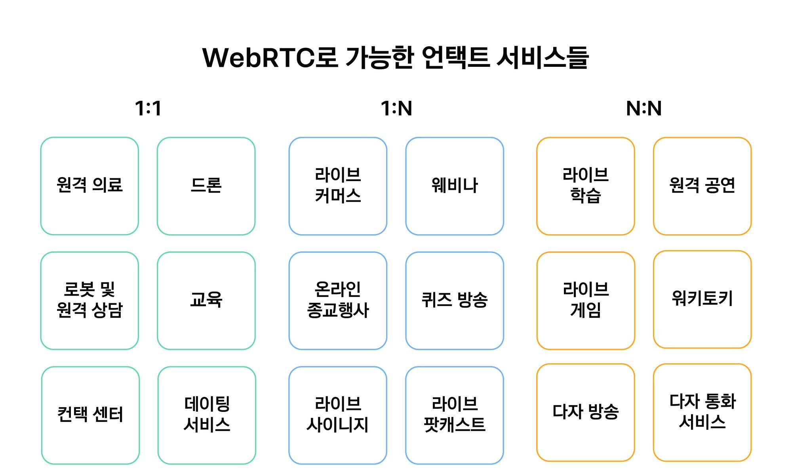

# WebRTC

서버를 최대한 거치지 않고 P2P(Peer-to-Peer Network)로 브라우저나 단말 간 데이터를 주고 받는 기술의 웹 표준

실시간 미디어 스트림을 송수신할 수 있는 표준이며 유일한 P2P 표준이다.

### WebRTC 특징
- 각각의 기기를 서버 도움 없이 연결하기 위해 -> 서버(**Signaling**) 필요
- P2P 연결이 불가능한 상황을 대비해 릴레이 서버(**TURN**)

### WebRTC 활용 분야

##### 1:1 방식 서비스

##### 1:N 방송 서비스

##### N:N 회의형 서비스  
---
### WebRTC 기술의 어려움
1. 네트워크 환경에 따른 품질의 불확실성
2. 고난이도의 미디어처리 영역
    1) 화상회의나 방송서비스의 경우 다양한 미디어 처리를 위한 서버들이 필요하다. 해당 기술이 WebRTC와는 무관하지만 서비스의 상품성을 위해 필요로 한다. 

    
    <u>파란색으로 표시된 부분이 WebRTC가 관여하는 부분이다</u>

**시그널링** : NAT 우회 과정을 통해 실시간으로 웹에서 데이터를 교환할 수 있다.

