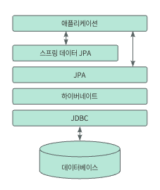
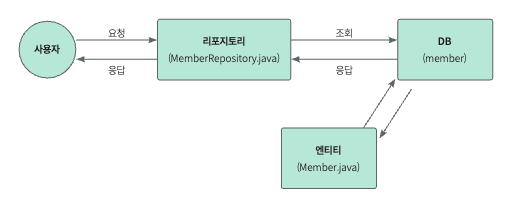

### DBMS
데이터베이스 관리자 (Database management system)

**RDBMS; 관계형 DBMS**
테이블 형태로 이루어진 데이터 저장소

### ORM
Object Relational Mapping; 자바의 객체와 데이터베이스를 연결하는 프로그래밍 기법
데이터베이스의 값을 객체처럼 사용할 수 있다.

**장점**
1. SQL을 직접 작성하지 않고 사용하는 언어로 데이터베이스에 접근할 수 있다.
2. 객체지향적으로 코드를 작성할 수 있기 때문에 비즈니스 로직에만 집중할 수 있다.
3. 데이터베이스 시스템에 대한 종속성이 줄어듭니다.
4. 매핑하는 정보가 명확하기 때문에 ERD에 대한 의존도를 낮출 수 있고, 유지보수 시 유리하다.

**단점**
1. 프로젝트의 복잡성이 커질수록 사용 난이도도 높다.
2. 복잡하고 무거운 쿼리는 ORM으로 해결이 불가능한 경우가 있다.

---
## JPA
JPA; Java Persistence API
자바에서 RDBMS를 사용하는 방식을 정의한 인터페이스
인터페이스 사용을 위해 ORM 프레임워크를 선택해야 한다. ex) 하이버네이트(hibernate) </br>
**하이버네이트**
JPA의 인터페이스를 구현한다. 내부적으로는 JDBC API를 사용한다.



### 엔티티 매니저 (Entity Manager)
**엔티티**
테이블과 매핑되는 객체
일반 객체와 달리 데이터베이스의 테이블과 직접 연결된다.

**엔티티 매니저**
엔티티를 관리해 데이터베이스와 애플리케이션 사이에 객체를 생성, 수정, 삭제하는 등의 역할
스프링부트는 내부에서 엔티티 매니저 팩토리를 하나만 생성해서 관리하고,
_@PersistenceContext_ 또는 _@Autowired_ 를 사용해 엔티티 매니저를 사용

** 엔티티 매니저는 Spring Data JPA에서 관리하므로 직접 생성 또는 관리할 필요가 없다
</br>

## 영속성 컨텍스트
엔티티를 관리하는 가상의 공간
쿼리문을 Java 코드로 작성하고 이를 JPA가 알아서 쿼리로 변경해준다.

**1차 캐시**
- 캐시의 키는 엔티티의 @Id 애너테이션이 달린 기본키 역할을 하는 식별자, 값은 엔티티
- 엔티티를 조회하면 1차 캐시에서 데이터를 조회하고 값이 있으면 반환
- 값이 없으면 데이터베이스에서 조회해 1차 캐시에 저장한 다음 반환
- 데이터베이스를 거치치 않아도 되므로 빠르게 데이터를 조회할 수 있다.

**쓰기 지연**
- 트랜잭션 커밋 전까지 데이터베이스에 실제로 질의문을 보내지 않고 쿼리를 모았다가 커밋하면 쿼리를 한번에 실행하는 것
- 적당한 묶음으로 쿼리를 요청할 수 있어 데이터베이스 시스템의 부담을 줄일 수 있다

**변경 감지**
- 트랜잭션을 커밋하면 1차 캐시에 저장되어 있는 엔티티의 값과 현재 엔티티의 값을 비교해서 변경된 값이 있다면 데이터베이스에 자동으로 반영
- 묶음으로 쿼리를 요청할 수 잇고, 데이터베이스 시스템의 부담을 줄일 수 있다.

**지연 로딩**
- 필요할 때 쿼리를 날려 데이터를 조회하는 것을 의미한다.
</br>

### 엔티티의 상태

**분리 상태**   ```em.detach(member);```
**관리 상태**   ```em.persist(member);```
**비영속 상태** ```Member member = new Member(1L, "홍길동");```
**삭제된 상태** ```em.remove(member);```

## 스프링데이터 JPA
**생성(Create)** ```memberRepository.save(new Member(1L, "A"));```
**조회(Read)**
```Optional<Member> member = memberRepository.findById(1L);```
```List<Member> allMembers = memberRepository.findAll();```
**삭제(Delete)** ```memberRepository.deleteById(1L);```

