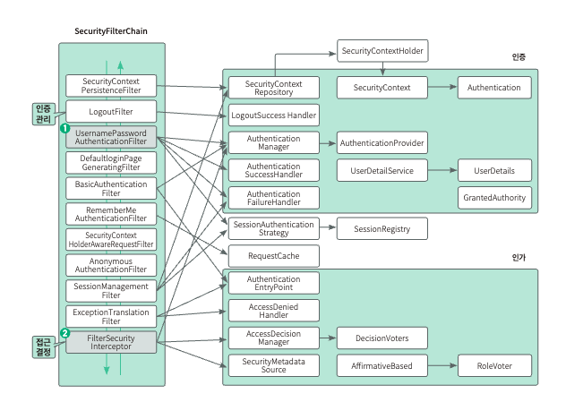
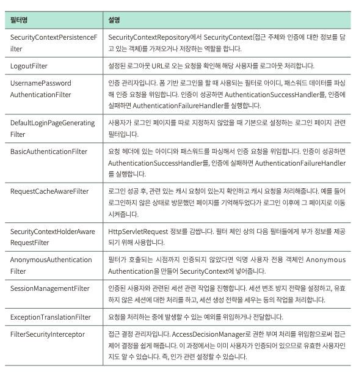
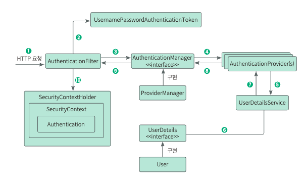

# 스프링 시큐리티
스프링 기반 애플리케이션의 보안(인증, 권한, 인가)을 담당하는 스프링 하위 프레임워크
<u>CSRF 공격, 세션 고정 공격을 방어해주고, 요청 헤더 보안처리도 해준다.</u>

**인증(Authentication)**: 보호된 리소스에 접근하는 것을 허용하기 전, 해당 사용자가 본인이 맞는지를 확인하는 절차
**인가(Authorization)**: 인증된 사용자가 요청한 자원에 접근 가능한지를 결정하는 절차

Spring Security는 인증 절차를 걸친 후 인가 절차를 진행하게 되며, 인가 과정에서 해당 리소스에 접근 권한이 있는지 확인한다. 
_Principal을 아이디로, Credential을 비밀번호로 사용하는 Credential 기반의 인증방식을 사용한다._
- Principal(접근 주체): 보호받는 리소스에 접근하는 대상
- Credential(비밀 번호): 리소스에 접근하는 대상의 비밀번호 

인증과 권한에 관한 부분을 **Filter 흐름**에 따라 처리한다.
Filter; Dispatcher Servlet으로 가기 전에 적용되므로 가장 먼저 URL 요청을 받지만, Interceptor는 Dispatcher와 Controller 사이에 위치한다는 점에서 적용 시기의 차이가 있다.

스프링 시큐리티는 위와 같은 다양한 필터들로 나누어져 있으며, 각 필터에서 인증, 인가와 같은 작업을 처리한다.
SecurityContextPersistenceFilter부터 아래로 내려가며 FilterSecurityInterceptor까지 순서대로 필터를 거친다.  
**UsernamepasswordAuthentica**
아이디와 패스워드가 넘어오면 인증 요청을 위임하는 인증 관리가 역할을 한다.

**FilterSecurityInterceptor**
권한 부여 처리를 위임해 접근 제어 결정을 쉽게 하는 접근 결정 관리자 역할을 한다.

1. 사용자가 폼에 아이디와 패스워드를 입력하면, HTTPServletRequest에 아이디와 비밀번호 정보가 전달된다. AuthenticationFilter가 넘어온 아이디와 비밀번호의 유효성 검사를 한다.
2. 유효성 검사가 끝나면 실제 구현체인 UsernamePasswordAuthenticationToken을 만들어서 넘겨준다.
3. 전달받은 인증용 객체인 UsernamePasswordAuthenticationToken을 AuthenticationManager에게 보낸다.
4. UsernamePasswordAuthenticationToken을 AuthenticationProvider에 보낸다.