# Jenkins 설치 (Windows)

### https://www.jenkins.io/download/ 에 접속해 윈도우용 젠킨스를 다운 후, 설치한다

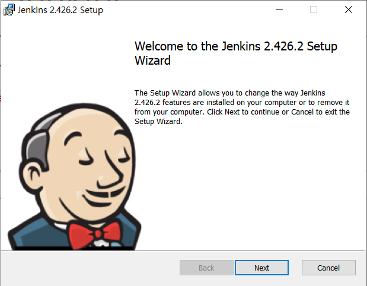
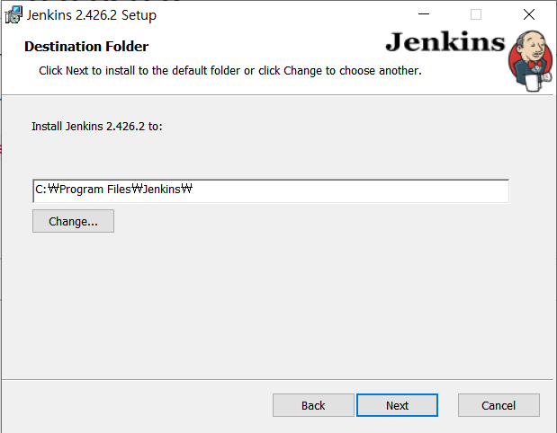
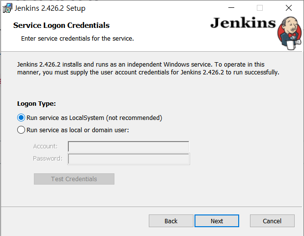
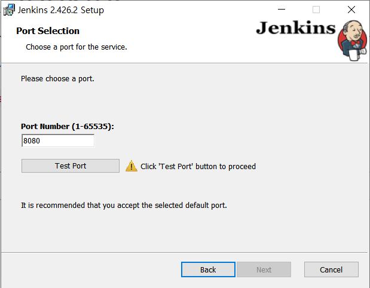
#### 포트 번호의 경우 사용 중인 포트 번호인지 확인해야 한다.
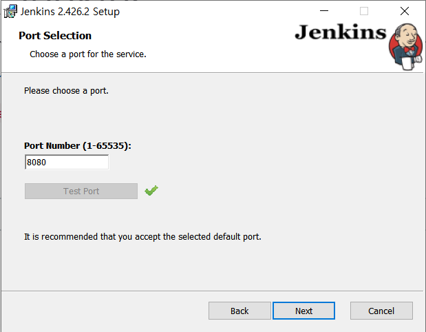
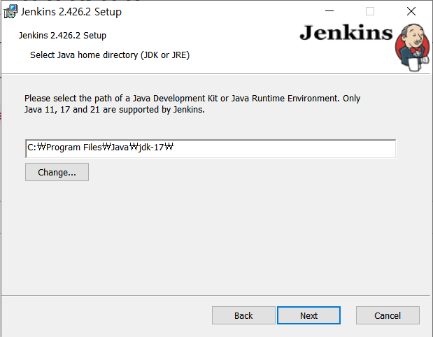

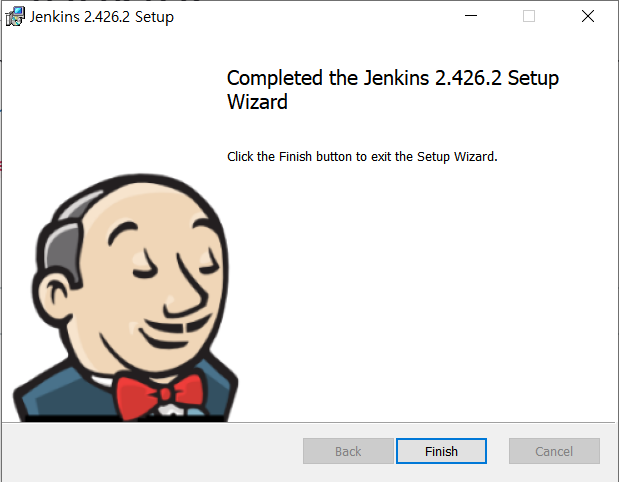

### 설치가 완료되었다면 http://localhost:8080 으로 접속한다

#### 화면에 붉은 글씨로 표시되는 주소로 들어간다.
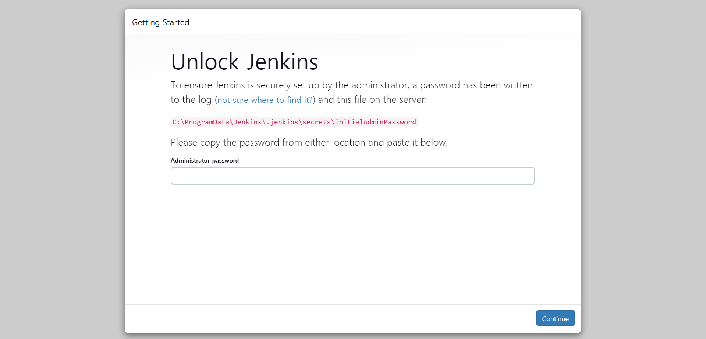

#### initialAdminPassword 파일에 있는 초기 비밀번호를 입력한다
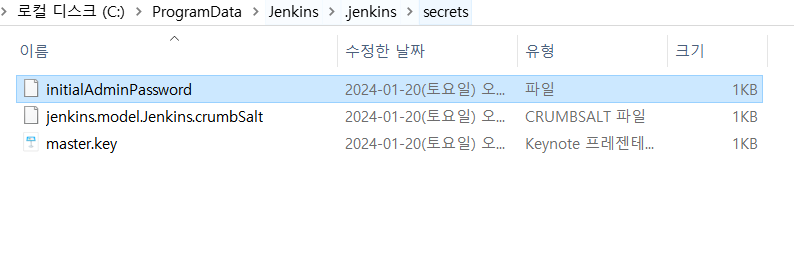

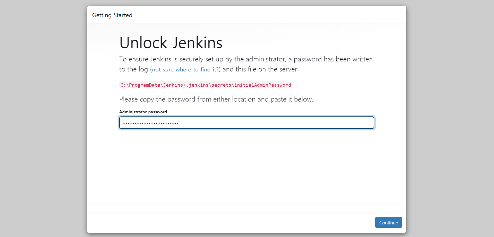

#### 플러그인을 설치한다
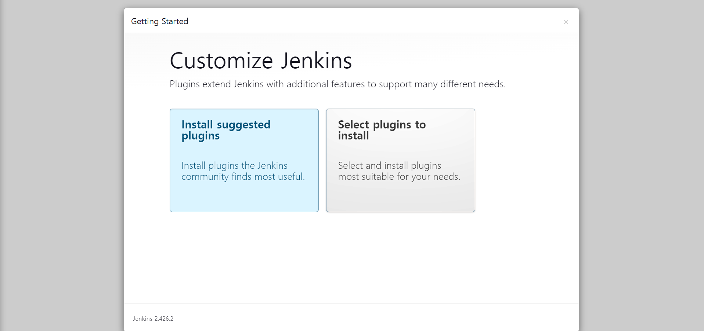

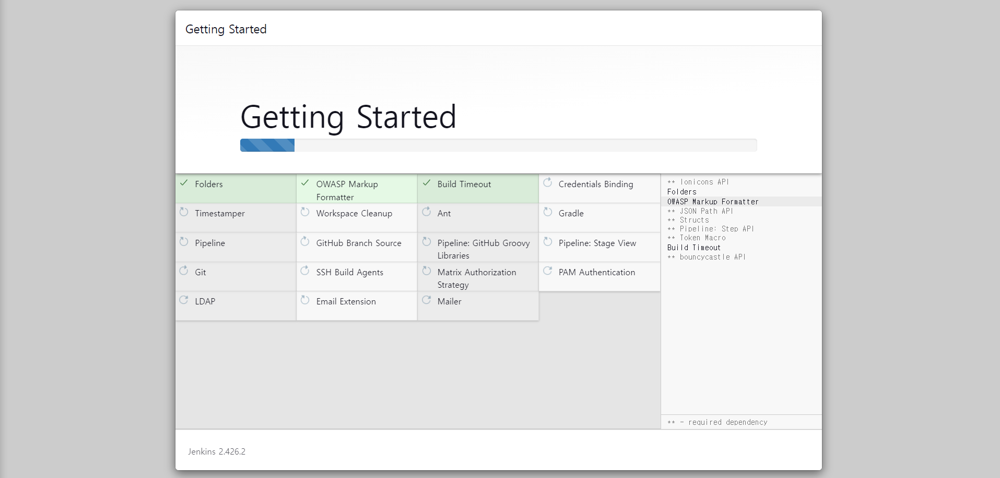

#### 관리자 계정을 만들고, 주소를 생성한다. (나는 포트 번호와 동일하게 했다.)
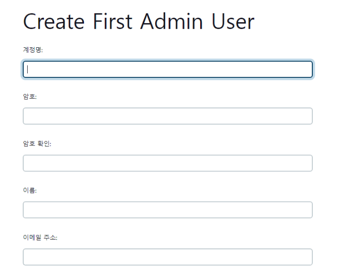

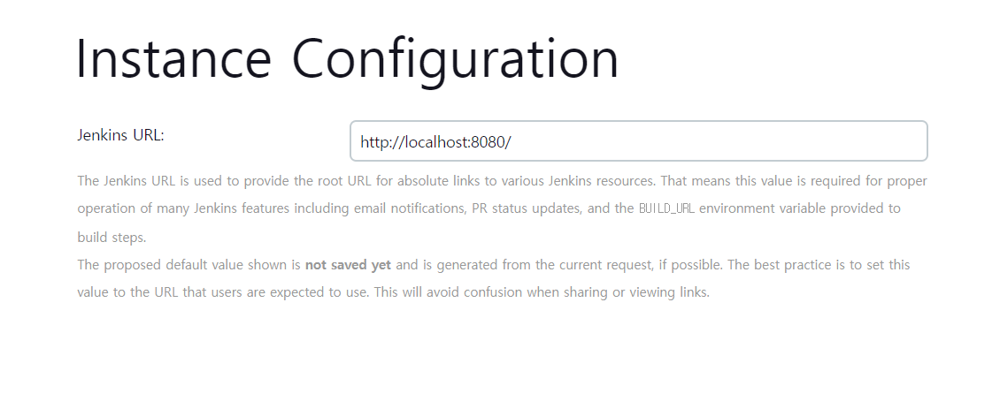

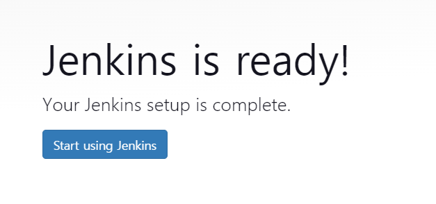

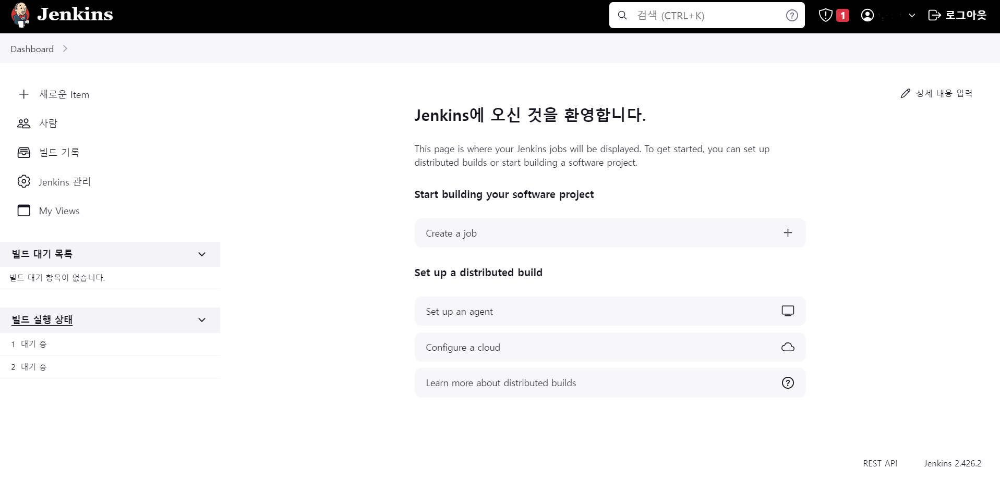