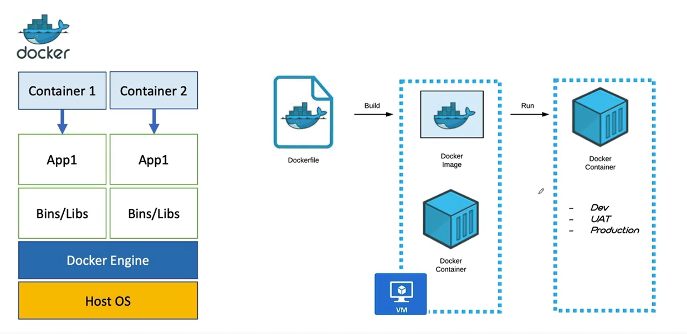
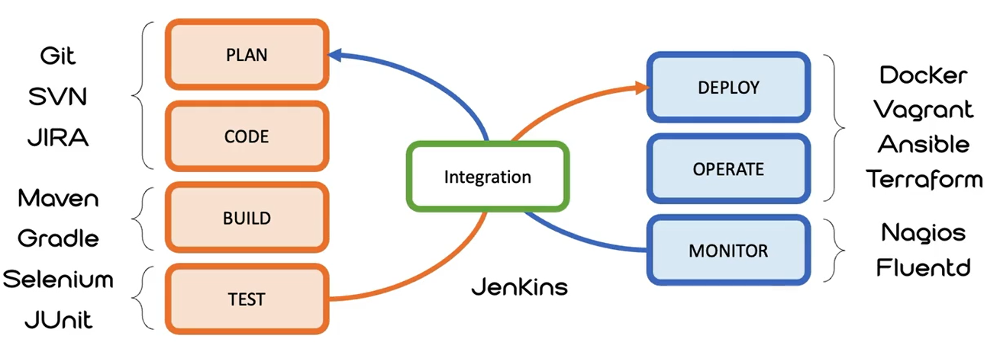

### Waterfall
- 요구사항정의
- 분석/설계
- 구현
- 테스트
- 운영

### Agile
Waterfall의 경우 지나치게 계획에 의존적이고 형식적인 절차를 따르고 있기 때문에 시간이 오래 걸리고 효율성이 저하된다.

 

# Cloud Native Application
**DevOps**: Development + Operation  
**Containers**  
**Microservices**  
**CI/CD**  

### Cloud Native Architecture
클라우드 네이티브 아키텍처 및 기술은 클라우드에서 빌드되고 클라우드 컴퓨팅 모델을 최대한 활용하는 워크로드를 디자인, 생성 및 운영하는 접근 방식입니다.

클라우드 네이티브 기술을 통해 조직은 퍼블릭, 프라이빗 및 하이브리드 클라우드와 같은 최신 동적 환경에서 확장 가능한 애플리케이션을 빌드하고 실행할 수 있습니다. 컨테이너, 서비스 메시, 마이크로 서비스, 변경할 수 없는 인프라 및 선언적 API는 이 접근 방식을 예로 들 수 있습니다.

이러한 기술을 사용하면 복원력, 관리 가능 및 관찰 가능한 느슨하게 결합된 시스템을 사용할 수 있습니다. 강력한 자동화와 결합되어 엔지니어는 최소한의 수고로 자주 예측 가능하게 높은 영향을 미치는 변경을 할 수 있습니다.

**MSA**

## Cloud Native - Containerization

**DevOps**  
- 인프라로 코드 관리 
- 애자일 인프라 스트럭쳐
- 애자일 시스템 관리 운동
- Lean Startup
- 지속적인 통합 및 배포 운동 -> CI, CD

엔지니어가 프로그래밍하고 빌드하고 직접 시스템에 배포 및 서비스를 RUN  
사용자와 끊임 없이 Interaction 하면서 서비스를 개선해 나가는 일련의 과정

## Cloud Native - CI/CD

젠킨스를 통해 CI/CI 자동화 파이프라인 처리