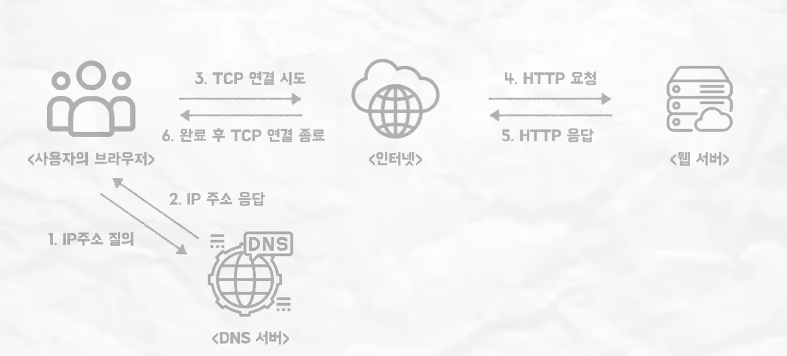

## Build
자연어를 기계어로 변환
기계가 바로 실행할 수 있는 압축된 파일(jar/war)로 패키징

컴파일 -> jar파일 생성 -> 테스트 -> build directory에 결과물 저장

## Deploy
실행 가능한 파일을 사용자가 접근할 수 잇는 환경에 배치 및 실행하는 것
사용자가 웹서비스를 사용할 수 있도록 하는 것
모니터링 및 유지보수 또한 배포에 포함

1. 서버 환경 구축
2. 배포 파일 업로드
3. 빌드 및 빌드된 파일 실행
4. 외부 접근 설정
5. 모니터링 및 유지보수

#### 서버 환경 구축

**전달되는 파일 유형에 따른 환경 구축 차이**
<table>
<tr>
<th>소스코드</th>
<th>jar 파일</th>
<th>war 파일</th>
</tr>
<tr>
<td>서버에서 빌드</td>
<td>로컬에서 빌드</td>
<td>로컬에서 빌드</td>
</tr>
<tr>
<td>서버에 jdk 설치</td>
<td>서버에 jre 설치</td>
<td>서버에 jre, WAS 설치</td>
</tr>

</table>