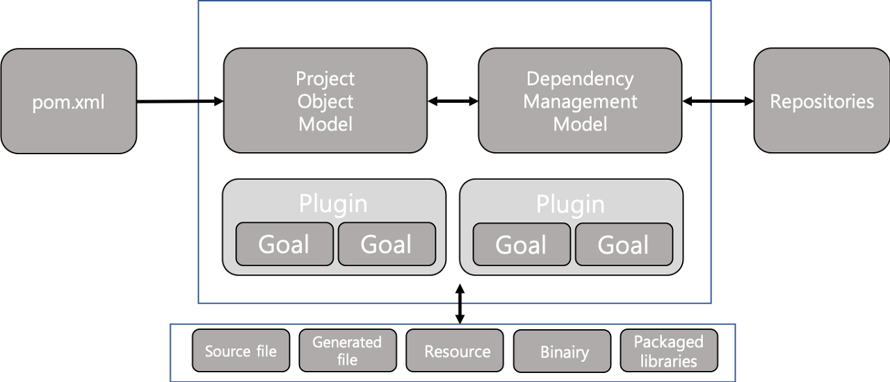
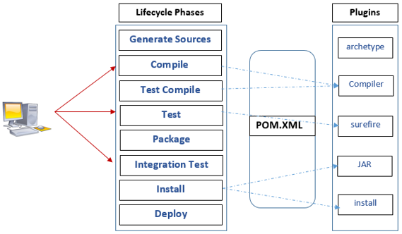
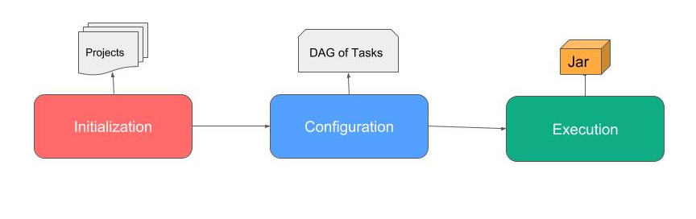
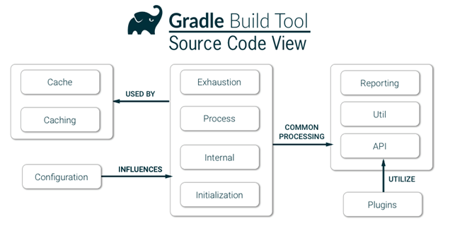

### Ant? Maven? Gradle?

- 빌드 관리 도구
    - 소스코드에서 어플리케이션 생성을 자동화 하기 위한 프로그램
    - 라이브러리를 자동으로 관리해주는 도구
    - java 코드 및 xml, properties, jar 파일들을 JVM 이나 WAS가 인식할 수 있도록 패키징 해주는 도구

- 라이브러리가 너무 많아지고 있으며, 버전 동기화가 어렵다.
    -> 빌드 관리 도구를 사용하자!

#### Ant(Apach Ant)

- 과거에 사용했던 자바 기반 빌드 도구

- 특징
    - XML 기반으로 빌드 스크립트 작성
    - 자유롭게 빌드 단위를 지정할 수 있다.
    - 생명주기를 갖지 않기 때문에 각각의 target에 대한 의존관계와 일련의 작업을 정의해 주어야 함.

- 단점
    - XML, Remote, Repository를 가져올 수 없었음(IVY 도입)
    - 빌드 단위나 스크립트를 직접 작성해줘야 하기 때문에 프로젝트가 커지는 경우 스크립트 관리나 빌드 과정이 복잡해진다.

- 설정 파일 : build.xml

#### Maevn

- 빌드 + 자동 라이브러리 관리 기능이 추가되었다.
    -> Ant의 불편함 해소 + 부가기능 추가
- XML 기반 상속 구조를 가지고 있는 빌드 도구
- LifeCycle

특징
    - XML 기반 작성
    - 라이브러리의 종속성 관계를 pom.xml 파일에 명시
    - 명시한 라이브러리 + 부가적으로 필요한 라이브러리도 네트워크를 통해 자동으로 처리
    - 생명 주기를 가지고 있다.(LifeCycle)
    - 상속 구조?

- 특정 설정을 소수의 모듈에서 공유하기 위해선 비어있는 프로젝트를 만들어서 공통 설정을 넣고 그걸 상속하게 해야함
    -> 쓸데 없이 설정이 길어지고 중복이 발생하여 가독성이 매우 떨어짐

- 설정파일 : pom.xml, setting.xml

#### Gradle

- 오픈소스 기반의 build 자동화 시스템
- Groovy 기반 DSL(Domain-Specific Language)로 작성된 빌드 도구

특징
    - 설정 주입 방식
        - 공통 설정은 공통으로, 모듈별로 필요한 설정들은 모듈별로 설정
            -> 멀티 모듈 프로젝트에서 용이
    - 스크립트 언어로 구성되어 있어 간편하게 사용 가능
    - Maven과 lvy 완전 지원

- 설정파일 : build.gradle, setting.gadle

#### XML? Groovy?
- Build라는 동적인 요소를 XML로만 정의하기엔 설정 내용이 길어지고 가독성이 떨어진다.
- Groovy의 경우 간단하게 사용 가능(, 가독성), 동적인 빌드는 스크립트로 직접 코드를 구현해서 확장 가능

#### 상속구조? 설정 주입 방식?

- 상속 구조의 경우 특정 설정을 소수의 모듈에서 공유하기 위해선 비어있는 프로젝트를 만들어서 공통 설정을 넣고 그걸 상속하게 해야함
- 설정 주입 방식의 경우 필요한 프로젝트에 바로 주입하는 방식이라 공통적으로 필요한 설정은 공통으로 주입하고, 모듈별로 필요한 설정들은 모듈별로 설정할 수 있다.
-> 멀티 모듈 프로젝트에 Gradle이 더 적합하다.

#### 성능 비교

Gradle이 Maven 보다 최대 100배 빠름
- 증분성(incrementaility) : 변경된 파일만 작업해 중복 작업을 피한다.
- Build cache : 동일한 입력에 대해서 gradle 빌드를 재사용 한다.
- Gradle 데몬 : 빌드 정보를 메모리에 유지하는 프로세스를 구동한다.

*멀티 모듈 프로젝트

*DSL(Domain Specific Language)

* 

*****

##### Maven LifeCycle

- Default(Build) : 일반적인 빌드 프로세스를 위한 모델이다.
- clean : 빌드 시 생성되었던 Output 및 파일들을 지워주는 단계
- Vaildate : 프로젝트가 올바른지 확인하고 필요한 모든 정보를 사용할 수 있는지 확인하는 단계
- Compile : 프로젝트의 소스 코드를 컴파일 하는 단계
- Test : 유닛(단위) 테스트를 수행하는 단계(테스트 실패 시 빌드 실패로 처리, 스킵 가능)
- Package : 실제 컴파일 된 소스 코드와 리소스들을 jar 파일 등의 배포를 위한 패키지로 만드는 단계
- Install : 패키지를 로컬 저장소에 설치하는 단계
- Default(Build) : 일반적인 빌드 프로세스를 위한 모델이다.
- Site : 프로젝트 문서와 사이트 작성, 생성하는 단계
- Deploy : 만들어진 package를 원격 저장소에 release 하는 단계

##### Gradle LifeCycle

- 초기화(initialization) : 빌드 대상 프로젝트를 결정하고 각각에 대한 Project 객체를 생성한다. settings.gradle 파일에서 프로젝트를 구성한다.
- 구성(Configuration) : 빌드 대상이 되는 모든 프로젝트의 빌드 스크립트를 실행한다.
- 실행(Execution) : 구성 단계에서 생성하고 설정된 프로젝트의 테스크 중에 실행 대상을 결정한다. gradle 명령행에서 지정한 태스크 이름 인자와 현재 디렉토리를 기반으로 태스크를 결정하여 선택된 태스크들을 실행한다.

Ant - build.xml

// build.xml
<?xml version="1.0" encoding="UTF-8"?>
<!-- 프로젝트 빌드용 Ant 스크립트. build.properties의 내용을 기본 설정으로 사용한다.-->
<project name="common" default="compile">
    <property name="src.dir" value="src" />
	 
  	<target name="clean">
        <delete dir="build"/>
    </target>

    <target name="compile">
        <mkdir dir="build/classes"/>
        <javac srcdir="src" destdir="build/classes"/>
    </target>

    <target name="jar">
        <mkdir dir="build/jar"/>
        <jar destfile="build/jar/HelloWorld.jar" basedir="build/classes">
            <manifest>
                <attribute name="Main-Class" value="oata.HelloWorld"/>
            </manifest>
        </jar>
    </target>

    <target name="run">
        <java jar="build/jar/HelloWorld.jar" fork="true"/>
    </target>
</project>

ivy

<dependency org="org.projectlombok" name="lombok" rev="1.18.16"/>

Maven - pom.xml

// POM.xml
<project xmlns="http://maven.apache.org/POM/4.0.0" xmlns:xsi="http://www.w3.org/2001/XMLSchema-instance"
  xsi:schemaLocation="http://maven.apache.org/POM/4.0.0 http://maven.apache.org/xsd/maven-4.0.0.xsd">
  <modelVersion>4.0.0</modelVersion>
 
  <groupId>com.mycompany.app</groupId>
  <artifactId>my-app</artifactId>
  <version>1.0-SNAPSHOT</version>
 
  <properties>
    <maven.compiler.source>1.7</maven.compiler.source>
    <maven.compiler.target>1.7</maven.compiler.target>
  </properties>
 
  <dependencies>
    <dependency>
      <groupId>junit</groupId>
      <artifactId>junit</artifactId>
      <version>4.12</version>
      <scope>test</scope>
    </dependency>
  </dependencies>
</project>

Grade - build.gradle

plugins {
    id 'org.springframework.boot' version '2.3.4.RELEASE'
    id 'io.spring.dependency-management' version '1.0.10.RELEASE'
    id 'java'
}

group = 'com.example'
version = '0.0.1-SNAPSHOT'
sourceCompatibility = '1.8'

configurations {
    compileOnly {
        extendsFrom annotationProcessor
    }
}

repositories {
    mavenCentral()
}

dependencies {
    implementation 'org.springframework.boot:spring-boot-starter-web'
    testImplementation('org.springframework.boot:spring-boot-starter-test') {
        exclude group: 'org.junit.vintage', module: 'junit-vintage-engine'
    }
}

test {
    useJUnitPlatform()
}

