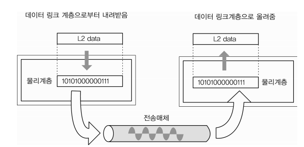
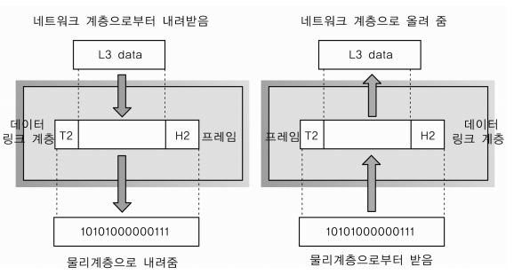
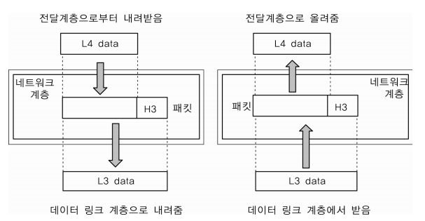
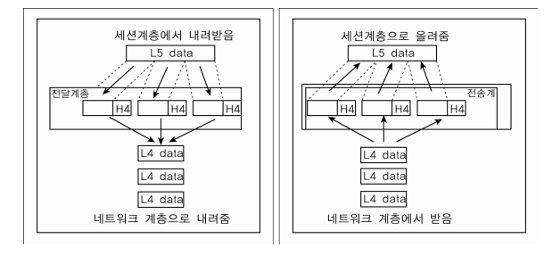

### OSI 7계층
- 네트워크에서 통신이 일어나는 과정을 7단계로 나눈 것

- 계층적 구조를 사용하는 목적
    - 분할 정복
        - 문제가 발생하였을 때 나누어 생가하면 쉽게 해결할 수 있다.

*PDU(Process Data Unit)
- 각 계층에서 전송되는 단위
    - 2계층 : 프레임
    - 3계층 : 패킷
    - 4계층 : 세그먼트

#### 1계층 - 물리계층(Physical Layer)

- 상위 계층에서 전송된 데이터를 물리적인 전송 매체를 통해 다른 시스템에 전기적 신호로 전송하는 역할. 기계어를 전기적 신호로 바꿔서 아이어에 실어주는 것.
- 비트 단위로 통신한다.
- 단지 데이터를 전달할 뿐 데이터가 무엇인지, 어떤 에러가 잇는지 등에는 전혀 신경쓰지 않으며, 데이터를 전기 신호로 변환해서 주고받는 기능만 한다.

-> 전송 단위 : 비트 - 전기 신호의 흐름
-> 장비 : 통신 케이블 허브
-> 프로토콜 : Modem, Cable, Fiber, RS-232C

-> 데이터를 전기적인 신호로 변환해서 주고받는 기능만 수행

#### 2계층 - 데이터 링크계층(DataLink Layer)

- 네트워크 기기들 사이의 데이터를 전송하는 역할
- 시스템 간의 오류 없는 데이터 전송을 위해 패킷을 프레임으로 구성하여 물리계층으로 전송한다.

- 물리 계층을 통해 송수신되는 데이터의 전송 오류를 감지하고, 재전송 하는 기능을 가지고 있다.
- 네트워크 계층에서 정보를 받아 주소와 제어 정보를 헤더와 테일에 추가한다.

- 맥 주소를 가지고 통신하게 된다.
- 포인트 투 포인트간 신뢰성있는 전송을 보장하기 위한 계층으로 CRC 기반의 오류 제어와 흐름 제어가 필요하다.

-> 전송 단위 : 프레임
-> 장비 : 브리지, 스위치 등
-> 프로토콜 : 이더넷, MAC, PPP, ATM, LAN, Wifi

##### MAC vs IP
- IP 주소 간의 통신은 각 라우터에서 일어나는 MAC 주소와 MAC 주소 통신의 연속적인 과정이다.
- IP가 시작점과 끝점에 해당하는 주소라면, MAC 주소는 편지가 거쳐가는 중간 거점들

*CRC
- 뭐고?

#### 3계층 - 네트워크 계층(Network Layer)

- 데이터그램이 가는 경로를 설정해주는 역할
- 데이터를 목적지까지 가장 안전하고 빠른 경로로 전달하는 기능(라우팅)

- 전송되는 데이터는 패킷 단위로 분할하여 전송한 후 다시 합쳐진다.
- 여러개의 노드를 거칠때마다 경로를 찾아주는 역할
- 다양한 길이의 데이터를 네트워크를 통해 전달하고, 그 과정에서 전송 계층이 요구하는 서비스 품질(QoS)을 제공하기 위한 기능적, 절차적 수단을 제공.

- 데이터를 연결하는 다른 네트워크를 통해 전달함으로써 인터넷이 가능하게 만드는 계층

-> 전송 단위 : 패킷(packet)
-> 장비 : 라우터, L3 스위치
-> 프로토콜 : IP, IMCP 등

##### IP 계층

- TPC/IP 상에서 IP 계층이란 네트워크의 주소(IP 주소)를 정의하고, IP 패킷의 전달 및 라우팅을 담당하는 계층
- 패킷을 목적지까지 전달하는 역할 및 그에 수반되는 기타 역할을 한다.

- IP 계층에서는 그 하위계층인 데이터링크 계층의 하드웨어저인 특성에 관계없이 독립적인 역할을 수행

IP 계층 상에 있는 주요 프로토콜
- 패킷의 전달을 책임지는 IP
- 패킷 전달 에러의 보고 및 진달을 위한 ICMP
- 복잡한 네트워크에서 인터네트워킹을 위한 경로를 찾게해주는 라우팅 프로토콜

##### IP 프로토콜
- TCP/IP 기반의 인터넷 망을 통하여 데이타그램의 전달을 담당하는 프로토콜

- 주요 기능
    - IP 계층에서 IP 패킷의 라우팅 대상이 됨(Routing)
    - IP 주소 지정(Addressing)

- 주요 특징
    - 신뢰성(에러제어) 및 흐름제어 기능이 없음.
    - 비연결성 데이터그램 방식으로 전달되는 프로토콜
    - 패킷의 완전한 전달을 보장하지 않음.
    - IP 패킷 헤더 내 수신 및 발신 주소를 포함
    - IP 헤더 내 바이트 전달 순서 : 최상위 바이트(MSB)를 먼저 보냄
    - 경우에 따라 단편화가 필요하다.
    - TCP, UDP, ICMP, IGMP 등이 IP 데이타그램에 실려서 전송

*패킷
- 뭐고?

#### 4계층 - 전송 계층(Transport Layer)

- 통신을 활성화하기 위한 계층이다.
- 발신지에서 목적지(End-toEnd) 간 제어와 에러를 관리한다.
    - 오류 검출 및 복구, 흐름 제어와 중복 검사 등을 수행
- 패킷(Packet)의 전송이 유효한지 확인하고전송에 실패된 패킷을 다시 전송
- 헤드에 포트번호가 포함되어 있다.
    - 포트 번호 : 디바이스에 있는 여러 프로세스 중 자기가 가야 할 프로세스를 구분하기 위해 필요한 번호

- 보통 TCP 프로토콜을 이용하며, 포트를 열어서 응용프로그램들이 전송을 할 수 있게 한다.
- 데이터를 송신하면 4계층에서 해당 데이터를 하나로 합쳐서 5계층에 수신한다.
- 단대단 오류제어 및 흐름제어 이 계층 까지는 물리적인 계층에 속한다.

-> 전송 단위 : 세그먼트(Segment)
-> 장비 : 게이트웨이, L4 스위치
-> 프로토콜 : TCP, UDP, ARP, RTP

##### TCP 프로토콜(Transmission Control Protocol)
- 양종단 호스트 내 프로세스 상호 간에 신뢰적인 연결지향성 서비스를 제공
    - IP의 비신뢰적인 최선형 서비스에다가 신뢰적인 연결지향성 서비스를 제공하게 됨
    - 신뢰적인 전송을 보장하게 함으로써, 어플리케이션 구현이 한층 쉬워지게 됨

- 신뢰성(Reliable)
    - 패킷 손실, 중복, 순서바뀜 등이 없도록 보장
    - TCP 하위계층인 IP 계층의 신뢰성 없는 서비스에 대해 다방면으로 신뢰성을 제공

- 연결지향적(Connection-oriented)
    - 같은 전송계층의 UDP가 비연결성인 것과는 달리, TCP는 연결지향적 이다.(느슨한 연결, Loosly Connected)
    - 연결 관리를 위한 연결설정 및 연결해제 필요
    - 양당간 어플리케이션/프로세스는 TCP가 제공하는 연결성 회선을 통하여 서로 통신

##### UDP 프로토콜(User Datagram Protocol)
- 신뢰성이 낮은 프로토콜로써 완전성을 보장하지 않으나, 가상회선을 굳이 확립할 필요가 없고 유연하며 효울적 응용의 데이터 전송에 사용

- 비연결성, 신뢰성 X, 순서화되지 않은 Datagram 서비스 제공
    - 메세지가 제대로 도착했는지 확인하지 않음 (확인응답 없음)
    - 수신된 메세지의 순서를 맞추지 않음 (순서제어 없음) 
    - 흐름 제어를 위한 피드백을 제공하지 않음 (흐름제어 없음)
    - 검사합을 제외한 특별한 오류 검출 및 제어 없음 (오류제어 거의 없음)
        - UDP를 사용하는 프로그램 쪽에서 오류제어 기능을 스스로 갖추어야 함
    - 데이터그램 지향의 전송계층용 프로토콜 (논리적인 가상회선 연결이 필요없음)
        - 비연결접속상태 하에서 통신 

- 실시간 응용 및 멀티캐스팅 가능
    - 빠른 요청과 응답이 필요한 실시간 응용에 적합.
    - 여러 다수 지점에 전송 가능(1:多)

- 헤더가 단순함
    - UDP는 TCP처럼 16비트의 포트 번호를 사용하나, 헤더는 고정크기의 8바이트(TCP는 20바이트)만 사용한다.

#### 5계층 - 세션 계층(Session Layer)
- 데이터가 통신하기 위한 논리적인 연결을 말한다.
- 세션 설정, 유지, 종료, 전송 중단시 복구 등의 기능이 있다.

- 세션 계층은 양 끝단의 응용 프로세스가 통신을 관리하기 위한 방법을 제공한다.
- 동시 송수신 방식(duplex), 반이중 방식(half-duplex), 전이중 방식(full duplex)의 통신과 함께, 체크 포인팅과 유휴, 종료, 다시 시작 과정 등을 수행한다.
- TCP/IP 세션을 만들고 없애는 책임을 진다.

-> 통신하는 사용자들을 동기화하고 오류복구 명령들을 일괄적으로 다룬다.
-> 통신을 하기 위한 세션을 확립/유지/중단 (운영체제가 해줌)

#### 6계층 - 표현 계층(Presentation Layer)
- 데이터 표현이 상이한 응용 프로세스의 독립성을 제공하고, 암호화 한다.
- 표현 계층은 코드 간의 번역을 담당하여 사용자 시스템에서 데이터의 형식상 차이를 다루는 부담을 응용 계층으로부터 덜어 준다.
- MIME 인코딩이나 암호화 등의 동작이 이 계층에서 이루어진다.
- EBCDIC로 인코딩된 문서 파일을 ASCII로 인코딩된 파일로 바꿔 주는 것, 해당 데이터가 TEXT인지, 그림인지 등의 구분이 표현 계층의 몫이다.

-> 사용자의 명령어를 완성 및 결과 표현. 포장/압축/암호화

#### 7계층 - 응용 계층(Application Layer)
- 최종 목적지. HTTP, FTP, SMTP, POP3, IMAP, Telent 등과 같은 프로토콜이 있다.
- 해당 통신 패킷들은 방금 나열한 프로토콜에 의해 모두 처리되며 우리가 사용하는 브라우저나, 매일 프로그램은 프로토콜을 보다 쉽게 사용하게 해주는 응용프로그램이다.
- 모든 통신의 양 끝단은 HTTP와 같은 프로토콜이지 응용프로그램이 아니다.

- 응용 계층은 응용 프로세스와 직접 관계하여 일반적인 응용 서비스를 수행한다.
- 일반적인 응용 서비스는 관련된 응용 프로세스들 사이의 전환 제공한다.
- 응용 서비스의 예로, 가상 터미널, JTM, 표준 ISO/IEC 8832 등이 있다.

-> 네트워크 소프트웨어 UI 부분, 사용자의 입출력(I/O) 부분

##### HTTP 프로토콜(HyperText Transfer Protocol)
- 웹 상에서 웹 서버 및 브라우저 상호 간의 데이터 전송을 위한 응용계층 프롵토콜

- 요청 및 응답의 구조(단방향)
    - 클라이언트/서버 모델로 동작
- 메세지 교환 형태의 프로토콜
- 트랜잭션 중심의 비연결성 프로토콜
    - 종단간 연결이 없음
    - 이전의 상태를 유지하지 않음
- TCP / 80
- 

나중에 하자

https://backendcode.tistory.com/167
-> 4계층 부터

https://lxxyeon.tistory.com/155

https://velog.io/@cgotjh/%EB%84%A4%ED%8A%B8%EC%9B%8C%ED%81%AC-OSI-7-%EA%B3%84%EC%B8%B5-OSI-7-LAYER-%EA%B8%B0%EB%B3%B8-%EA%B0%9C%EB%85%90-%EA%B0%81-%EA%B3%84%EC%B8%B5-%EC%84%A4%EB%AA%85

https://velog.io/@jybin96/OSI-7%EA%B3%84%EC%B8%B5%EC%9D%B4%EB%9E%80-%EB%AC%B4%EC%97%87%EC%9D%BC%EA%B9%8C

https://www.cloudflare.com/ko-kr/learning/ddos/glossary/open-systems-interconnection-model-osi/

