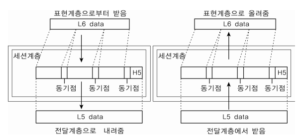
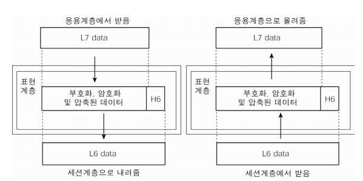
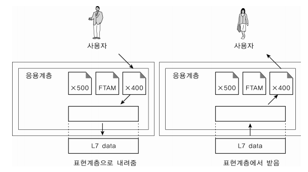
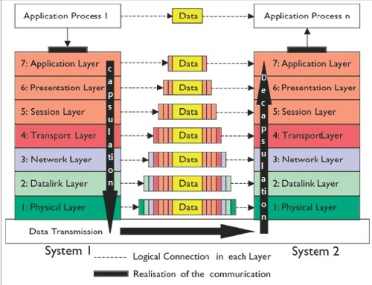

### OSI 7계층
- 네트워크에서 통신이 일어나는 과정을 7단계로 나눈 것

- 계층적 구조를 사용하는 목적
    - 분할 정복
        - 문제가 발생하였을 때 나누어 생가하면 쉽게 해결할 수 있다.

- 7 -> 1 계층 - 캡슐화 : 각 층마다 인식할 수 있어야 하는 헤더를 붙임
- 1 -> 7 계층 - 디캡슐화 : 헤더를 떼어냄

*PDU(Process Data Unit)
- 각 계층에서 전송되는 단위
    - 2계층 : 프레임
    - 3계층 : 패킷
    - 4계층 : 세그먼트

#### 1계층 - 물리계층(Physical Layer)

- 상위 계층에서 전송된 데이터를 물리적인 전송 매체를 통해 다른 시스템에 전기적 신호로 전송하는 역할. 기계어를 전기적 신호로 바꿔서 아이어에 실어주는 것.
- 비트 단위로 통신한다.
- 단지 데이터를 전달할 뿐 데이터가 무엇인지, 어떤 에러가 잇는지 등에는 전혀 신경쓰지 않으며, 데이터를 전기 신호로 변환해서 주고받는 기능만 한다.

-> 전송 단위 : 비트 - 전기 신호의 흐름
-> 장비 : 통신 케이블 허브
-> 프로토콜 : Modem, Cable, Fiber, RS-232C

-> 데이터를 전기적인 신호로 변환해서 주고받는 기능만 수행

#### 2계층 - 데이터 링크계층(DataLink Layer)

- 네트워크 기기들 사이의 데이터를 전송하는 역할
- 시스템 간의 오류 없는 데이터 전송을 위해 패킷을 프레임으로 구성하여 물리계층으로 전송한다.

- 물리 계층을 통해 송수신되는 데이터의 전송 오류를 감지하고, 재전송 하는 기능을 가지고 있다.
- 네트워크 계층에서 정보를 받아 주소와 제어 정보를 헤더와 테일에 추가한다.

- 맥 주소를 가지고 통신하게 된다.
- 포인트 투 포인트간 신뢰성있는 전송을 보장하기 위한 계층으로 CRC 기반의 오류 제어와 흐름 제어가 필요하다.

-> 전송 단위 : 프레임
-> 장비 : 브리지, 스위치 등
-> 프로토콜 : 이더넷, MAC, PPP, ATM, LAN, Wifi

##### MAC vs IP
- IP 주소 간의 통신은 각 라우터에서 일어나는 MAC 주소와 MAC 주소 통신의 연속적인 과정이다.
- IP가 시작점과 끝점에 해당하는 주소라면, MAC 주소는 편지가 거쳐가는 중간 거점들

*CRC
- 뭐고?

#### 3계층 - 네트워크 계층(Network Layer)

- 데이터그램이 가는 경로를 설정해주는 역할
- 데이터를 목적지까지 가장 안전하고 빠른 경로로 전달하는 기능(라우팅)

- 전송되는 데이터는 패킷 단위로 분할하여 전송한 후 다시 합쳐진다.
- 여러개의 노드를 거칠때마다 경로를 찾아주는 역할
- 다양한 길이의 데이터를 네트워크를 통해 전달하고, 그 과정에서 전송 계층이 요구하는 서비스 품질(QoS)을 제공하기 위한 기능적, 절차적 수단을 제공.

- 데이터를 연결하는 다른 네트워크를 통해 전달함으로써 인터넷이 가능하게 만드는 계층

-> 전송 단위 : 패킷(packet)
-> 장비 : 라우터, L3 스위치
-> 프로토콜 : IP, IMCP 등

##### IP 계층

- TPC/IP 상에서 IP 계층이란 네트워크의 주소(IP 주소)를 정의하고, IP 패킷의 전달 및 라우팅을 담당하는 계층
- 패킷을 목적지까지 전달하는 역할 및 그에 수반되는 기타 역할을 한다.

- IP 계층에서는 그 하위계층인 데이터링크 계층의 하드웨어저인 특성에 관계없이 독립적인 역할을 수행

IP 계층 상에 있는 주요 프로토콜
- 패킷의 전달을 책임지는 IP
- 패킷 전달 에러의 보고 및 진달을 위한 ICMP
- 복잡한 네트워크에서 인터네트워킹을 위한 경로를 찾게해주는 라우팅 프로토콜

##### IP 프로토콜
- TCP/IP 기반의 인터넷 망을 통하여 데이타그램의 전달을 담당하는 프로토콜

- 주요 기능
    - IP 계층에서 IP 패킷의 라우팅 대상이 됨(Routing)
    - IP 주소 지정(Addressing)

- 주요 특징
    - 신뢰성(에러제어) 및 흐름제어 기능이 없음.
    - 비연결성 데이터그램 방식으로 전달되는 프로토콜
    - 패킷의 완전한 전달을 보장하지 않음.
    - IP 패킷 헤더 내 수신 및 발신 주소를 포함
    - IP 헤더 내 바이트 전달 순서 : 최상위 바이트(MSB)를 먼저 보냄
    - 경우에 따라 단편화가 필요하다.
    - TCP, UDP, ICMP, IGMP 등이 IP 데이타그램에 실려서 전송

*패킷
- 뭐고?

#### 4계층 - 전송 계층(Transport Layer)

- 통신을 활성화하기 위한 계층이다.
- 발신지에서 목적지(End-toEnd) 간 제어와 에러를 관리한다.
    - 오류 검출 및 복구, 흐름 제어와 중복 검사 등을 수행
- 패킷(Packet)의 전송이 유효한지 확인하고전송에 실패된 패킷을 다시 전송
- 헤드에 포트번호가 포함되어 있다.
    - 포트 번호 : 디바이스에 있는 여러 프로세스 중 자기가 가야 할 프로세스를 구분하기 위해 필요한 번호

- 보통 TCP 프로토콜을 이용하며, 포트를 열어서 응용프로그램들이 전송을 할 수 있게 한다.
- 데이터를 송신하면 4계층에서 해당 데이터를 하나로 합쳐서 5계층에 수신한다.
- 단대단 오류제어 및 흐름제어 이 계층 까지는 물리적인 계층에 속한다.

-> 전송 단위 : 세그먼트(Segment)
-> 장비 : 게이트웨이, L4 스위치
-> 프로토콜 : TCP, UDP, ARP, RTP

##### TCP 프로토콜(Transmission Control Protocol)
- 양종단 호스트 내 프로세스 상호 간에 신뢰적인 연결지향성 서비스를 제공

- 신뢰성(Reliable)
    - 패킷 손실, 중복, 순서바뀜 등이 없도록 보장 - ACK 사용
- IP가 처리할 수 있도록 데이터를 여러 개의 패킷으로 나누고, 도착지에서 완전한 데이터로 패킷을 재조립

- 세그먼트 단위로 전송

##### UDP 프로토콜(User Datagram Protocol)
- 신뢰성이 낮은 프로토콜로써 완전성을 보장하지 않으나, 가상회선을 굳이 확립할 필요가 없고 유연하며 효울적 응용의 데이터 전송에 사용

- 비연결성, 비신뢰성
- 패킷을 나누고 재조립하는 과정 없이, 수신지에서 제대로 받든 말든 상관하지 않고 데이터를 보내기만 한다.
    - 에러와 그에 따른 재전송, 대체는 애플리케이션에서 처리해야 한다.
- 속도가 빠르다.(Real Time Service에 적합)

- 블록 형태의 다이어그램으로 전송

- 추가
    - 메세지가 제대로 도착했는지 확인하지 않음 (확인응답 없음)
    - 수신된 메세지의 순서를 맞추지 않음 (순서제어 없음) 
    - 흐름 제어를 위한 피드백을 제공하지 않음 (흐름제어 없음)
    - 검사합을 제외한 특별한 오류 검출 및 제어 없음 (오류제어 거의 없음)
        - UDP를 사용하는 프로그램 쪽에서 오류제어 기능을 스스로 갖추어야 함
    - 데이터그램 지향의 전송계층용 프로토콜 (논리적인 가상회선 연결이 필요없음)
        - 비연결접속상태 하에서 통신 

- 헤더가 단순함
    - UDP는 TCP처럼 16비트의 포트 번호를 사용하나, 헤더는 고정크기의 8바이트(TCP는 20바이트)만 사용한다.

#### 5계층 - 세션 계층(Session Layer)

- 통신 세션을 구성하는 계층으로 포트 번호를 기반으로 연결한다.
- 통신 장치 간의 상호 작용을 설정하고 유지하며 동기화한다.
- 동시 송수신 방식(duplex), 반이중 방식(half-duplex), 전이중 방식(full duplex)의 통신과 함께, 체크 포인팅과 유휴, 종료, 다시 시작 과정 등을 수행한다.

*Session : 클라이언트와 웹 서버 간 네트워크 연결이 지속 유지되고 있는 상태
    - 사용자가 브라우저를 열어 서버에 접속한 뒤 접속을 종료할 시점까지를 의미

- 네트워크 상 양쪽 연결을 관리하고 연결을 지속시켜주는 계층
- 세션 설정, 유지, 종료, 전송 중단시 복구 등의 기능 (OS가 세션 계층으로 이 역할을 수행)
- TCP/IP 세션을 만들고 없애는 역할
- 통신하는 사용자들을 동기화하고 오류 복구 명령들을 일괄적으로 다룬다.

- 프로토콜 : NetBIOS, SSH, TLS

#### 6계층 - 표현 계층(Presentation Layer)

- 송신 측과 수신 측 사이에서 데이터 형식을 정해준다.
- 받은 데이터를 코드 변환, 구문 검색, 인코딩 - 디코딩 및 암호화, 압축의 과정을 통해 올바른 표준 방식으로 변환해준다.

- 응용 계층으로부터 전달받거나 전송하는 데이터의 인코딩 - 디코딩 및 암호화 등이 이루어진다.
- 코드 간의 번역을 담당하여 데이터의 형식상 차이를 다루는 부담을 응용 계층으로부터 덜어준다.

- EBCDIC로 인코딩된 문서 파일을 ASCII로 인코딩된 파일로 바꿔 주는 것, 해당 데이터가 TEXT인지, 그림인지 등의 구분이 표현 계층의 몫이다.

- 프로토콜 : JPG, MPEG, SMB, AFP

#### 7계층 - 응용 계층(Application Layer)

- 사용자와 바로 연결되어 있으며 응용 SW를 도와주는 계층
- 사용자로부터 정보를 입력받아 하위 계층으로 전달하고 하위 계층에서 전송한 데이터를 사용자에게 전달한다.
- 파일 전송, DB, 메일 전송 등 여러 가지 응용 서비스를 네트워크에 연결해주는 역할.

- 모든 통신의 양 끝단은 HTTP와 같은 프로토콜이지 응용프로그램이 아니다.

- 응용 계층은 응용 프로세스와 직접 관계하여 일반적인 응용 서비스를 수행한다.

- 프로토콜 : HTTP, DNS, Talnet, FTP 등
- 메일, 인터넷, 동영상 플레이어? 등

-> 네트워크 소프트웨어 UI 부분, 사용자의 입출력(I/O) 부분

##### HTTP 프로토콜(HyperText Transfer Protocol)
- 웹 상에서 웹 서버 및 브라우저 상호 간의 데이터 전송을 위한 응용계층 프롵토콜

- 요청 및 응답의 구조(단방향)
    - 클라이언트/서버 모델로 동작
- 메세지 교환 형태의 프로토콜
- 트랜잭션 중심의 비연결성 프로토콜
    - 종단간 연결이 없음
    - 이전의 상태를 유지하지 않음
- TCP / 80
- 

#### 흐름

1. 발신 측에서 응용 계층(7 Layer)부터 시작해 각 계층마다 헤더를 붙여 캡슐화를 진행
2. 수신 측에서는 물리 계층(1 Layer)부터 차례로 올라가면서 헤더를 떼 내는 디캡슐레이션을 진행하여 데이터 식별
    - ex) 데이터가 목적지로 이동할 때, 네트워크 계층(3 Layer)에서 IP 헤더에 있는 프로토콜 정보를 이용해 데이터가 TCP인지 UDP인지 식별한 후 그에 따른 처리를 전송 계층(4 Layer)에서 수행한다.
3. 목적지에 원하는 데이터가 전송된다.

#### 정리
7계층 - 응용 계층
    - 최정 목적지로 응용 프로세스와 직접 관계하여 일반적인 응용 서비스를 수행(explore, chrome 등)
    
    - HTTP, FTP, SMTP, POP3, IMAP, Telnet 등과 같은 프로토콜
6계층 - 표현 계층
    - 데이터의 표현방식을 결정(데이터 변환, 압축, 암호화)
    - 파일인코딩, 명령어를 포장, 압축, 암호화

    - JPEG, MPEG, GIF, ASCII
5계층 - 세션 계층
    - 주 지점간의 프로세스 및 통신하는 호스트 간의 연결 유지
    - TCP/IP 세션 체결, 포트번호를 기반으로 통신 세션 구성

    - 데이터
    - API, SOcket
4계층 - 전송 계층
    - 두 지점간의 신로성 있는 데이터를 주고 받을 수 있도록 한다.
    - 신호를 분산하고 다시 합치는 과정을 통해 에러와 경로를 제어
    - port 번호, 전송방식(TCP, UDP) 결정(TCP 헤더 붙음)

    - 데이터 / TCP 헤더
    - 세그먼트
3계층 - 네트워크 계층
    - 라우터를 통해 경로를 선택하고 주소를 정하고(IP) 경로(Route)에 따라 패킷을 전달(IP 헤더 붙음)

    - 데이터 / TCP 헤더 / IP 헤더
    - 패킷
    - 라우터
2계층 - 데이터 링크 계층
    - 물리계층을 통해 송수신되는 정보의 오류와 흐름을 관리
    - 프레임에 주소(MAC)를 부여하고 에러검출, 재전송, 흐름제어를 수행

    - 데이터 / TCP 헤더 / IP 헤더 / MAC 주소
    - 프레임
    - 브리지, 스위치, 이더넷
1계층 - 물리 계층
    - 데이터를 전기적인 신호(0, 1)로 변환해서 주고받는 기능만 한다.

    - 비트(0, 1)
    - 통신 케이블, 리피터, 허브

#### 링크

https://www.cloudflare.com/ko-kr/learning/ddos/glossary/open-systems-interconnection-model-osi/

https://backendcode.tistory.com/167

https://lxxyeon.tistory.com/155

