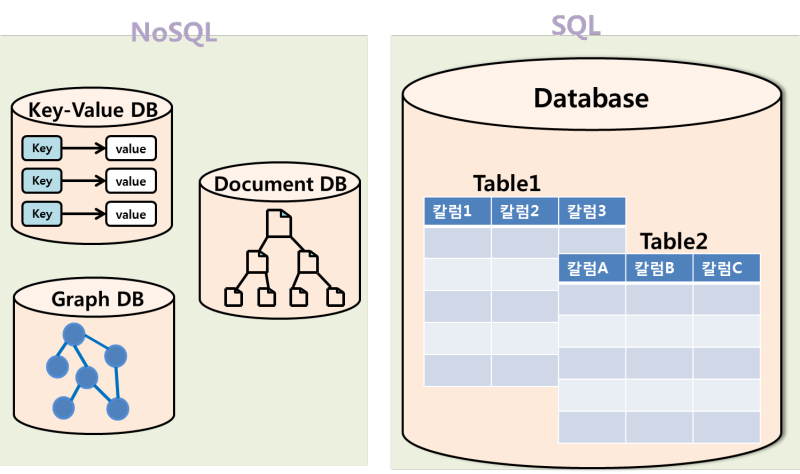
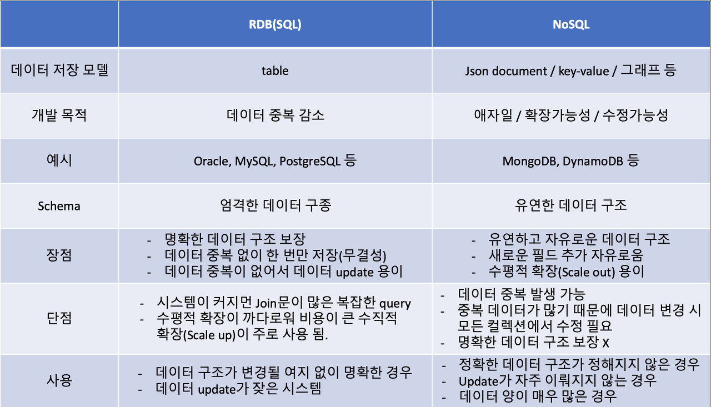
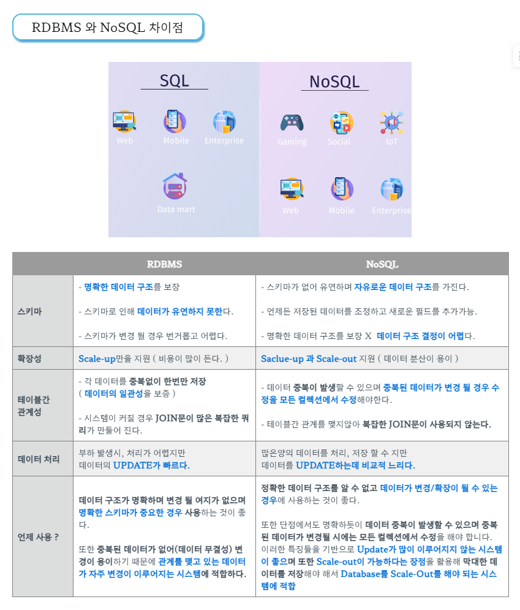

### RDBMS? NoSQL?

- DB(DataBase)
    - 컴퓨터 시스템에 전자 방식으로 저장되어 있는 구조화된 정보 또는 데이터의 체계적인 집합
    - 계층형 DB, 망형 DB, 관계형 DB등이 있음.

- SQL(Structed Query Language)
    - RDBMS의 관리를 위해 제작된 언어로써, 자료의 검색과 재조합, 스키마 생성과 수정과 같은 데이터베이스 객체 조정 관리를 위해 사용된다.

- DBMS
    - 데이터베이스 관리 시스템으로 사용자와 데이터 사이에서 사용자의 요청에 의해 데이터의 생성 조회 등 데이터베이스를 관리해주는 역할을 한다.
    - MySQL, Oracle, MariaDB, PostrgeSQL 등

***

#### RDBMS
- Relational Database Management System, 관계형 데이터베이스 관리 시스템
- 데이터 테이블 간의 정보가 서로 관계성을 가지고 있다.
- 2차원의 행렬로 테이블을 표현한다.
- ACID(Atomicity, Consistency, Isolation, Durability) 원칙을 기본으로 구성된 방식이다.
- 속성(Attribute)과 값(Value)을 이용

##### 특징
- 정해진 스키마에 따라 데이터를 저장해야 하므로 명확한 데이터 구조를 보장받을 수 있다.
- 각 테이블 간의 관계를 정의해야 하므로, 데이터 중복이 발생하지 않는다.

- 테이블 간 관계가 정의되어 있으므로 시스템이 커질 경우 JOIN문이 많은 복잡한 쿼리가 발생한다.
- 성능 향상의 방법으로 Scale-up만을 지원하므로 처리 비용이 크다.
- 정해진 스키마로 인해 데이터가 유연하지 못하다. 스키마가 변경될 경우 번거롭기 때문에 스키마가 자주 바뀌지 않는 서비스에 사용한다.

***

#### NoSQL
- Not Only SQL, 테이블 간 상호관계가 없다. 관계가 없으므로 테이블 간의 join도 없다.
- 빅데이터의 등장으로 데이터와 트래픽이 기하급수적으로 증가함에 따라 RDBMS의 단점인 성능을 향상시키기 위해 등장하였다.
- 데이터 일관성은 포기하되 비용을 고려하여 여러대의 데이터에 분산하여 저장하는 Scale-out을 목표로 등장하였다.

##### 특징
- 스키마가 없기 떄문에 데이터 구조가 유연하고, 자유롭게 필드를 추가할 수 있다.
- 성능 향상의 방법으로 Scale-up, Scale-out 모두 사용 가능하다.

- 스키마가 존재하지 않아서 데이터의 일관성이 존재하지 않는다.
- 데이터 중복이 발생할 수 있으며, 이 데이터가 변경될 경우 모든 컬렉션에서 update해야하는 번거로움이 있다.

##### 종류

- Key-Value DB
    - Key-Value 방식으로 데이터를 저장한다. Key값은 모든 데이터 타입을 수용할 수 있고, 중복되지 않는 유니크한 값이며, 간단한 구조인 만큼 속도가 빠르다.
    - 대표적으로 Redis, AWS DynamoDB, Riak 등이 있다.

- Document DB
    - Key-Value에서 확장된 방식으로 Key-Document 형태로 저장한다. Document는 계층적인 데이터 타입(JSON, XML)으로 저장되는 장점이 있으며 JSON 타입을 사용하므로 HTTP 기반의 웹서버의 경우 데이터를 편리하게 주고받을 수 있다.
    - 객체지향에서의 객체와 유사하여 하나의 단위로 취급되어 저장되므로 객체를 여러 개의 테이블에 나눠 저장할 필요가 없다.
    - 검색에 최적화되어 있다.
    - 대표적으로 MongoDB, CouchDB 등이 있다.

- Graph DB
    - 데이터를 Node와 Edge, Property와 함께 그래프 구조를 사용하여 데이터를 저장한다.
    - 객체와 관계를 그래프 형태로 표현한 것으로 관계형 모델이라고 할 수 있으며, 데이터 간의 관계가 키일 경우에 적잡하다.
    - SNS Network Diagrams 등에 사용되고, SNS에서 함께 아는 친구 찾기, 추천 등 연관된 데이터를 추천해주는 엔진이나 패턴 기능에 사용된다.
    - 대표적으로 Neo4J가 있다.

- Wide Column DataBase
    - Key-Value와 유사한 형태이다. 데이터가 내부에서 Key를 기준으로 오름차순으로 저장되며, Order by를 제공하지 않는 NoSQL에서 다양한 방법으로 활용할 수 있다.
    - 키에서 필드를 결정한다. 키는 Row(키 값)과 Column-family, Column-name을 가진다. 연관된 데이터들은 같은 Column-family 안에 속해 있으며, 각자의 Column-name을 가진다.
    - 저장된 데이터는 하나의 커다란 테이블로 표현이 가능하며, 질의는 Row, Column-family, Column-name을 통해 수행된다.
    - 대표적으로 HBase, Hypertable등이 있다.

***

#### 정리

RDBMS
- 데이터 구조가 명확하여 변경될 여지가 없는 경우
- 데이터 중복이 없으므로 update가 잦은 경우

NoSQL
- 데이터 구조가 정해지지 않은 경우(비정형)
- update가 적고 데이터 조회가 잦은 경우
- 데이터 양이 매우 많은 경우(scale-out 가능)
- JSON, XML등으로 저장하고 싶은 경우

*Scale-up : 수직적 확장
*Scale-out : 수평적 확장

***

#### 그냥 가져온 이미지

