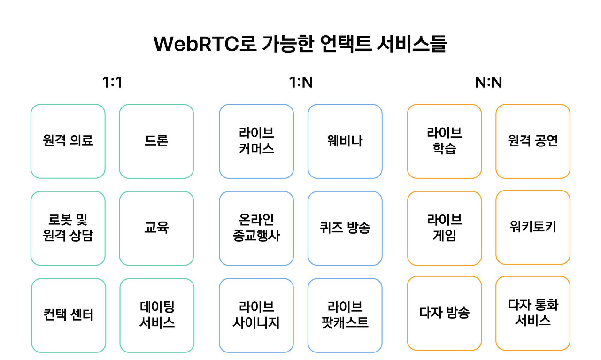

### WebRTC

#### 개념

Web Real-Time-Communication
- 웹 애플리케이션과 사이트가 중간자 없이 브라우저 간에 오디오나 영상 미디어를 포착하고 마음대로 스트림 할 뿐 아니라, 임의의 데이터도 교환할 수 있도록 하는 기술

->  드라이버나 플러그인 설치 없이 웹 브라우저 간 P2P 연결을 통해 데이터 교환을 가능하게 하는 기술

#### WebRTC Service

#### 특징

장점
- Latency가 짧다.
- 별다른 소프트웨어 없이 사용 가능하다.

단점
- 크로스 브라우징 문제
    - 지원하지 않는 브라우저, 버전이 있다.
    - 지금도 그러한가?
- STUN/TURN 서버가 필요하다.
    - P2P 통신을 하기 위해서는 사용자의 IP 주소를 알아야 한다.

#### API

- MediaStream
    - 카메라와 마이크 등의 데이터 스크림 접근
- RTCPeerConnection
    - 암호화 및 대역폭 관리 및 오디오, 비디오 연결
- RTCDataChannel
    - 일반적인 데이터의 P2P 통신

#### Signaling

- 시그널링을 통해 통신할 Peer간 정보를 교환한다.
- WebRTC를 사용해 연결을 맺고, peer의 단말에서 미디어를 가져와 교환한다.

*시그널링(Signaling)
    - WebRTC는 P2P연결을 통해 직접 통신하지만, 이를 중계해주는 과정이 필요하다. 이를 시그널링이라고 하며, 수행하는 서버를 시그널 서버라고 한다.
    - 시그널 서버는 연결하고자 하는 Peer들을 논리적으로 묶고 서로간에 SDP와 Candidate를 교환해준다.
    - 구현 방식에는 SIP, XMPP 등의 프로토콜을 사용해도 되고 Ajax long polling이나 websocket 등의 쌍방향 통신 채널 등이 있다.
    - 비동기적으로 발생하는 Peer들의 정보를 교환해야 하므로 전이중 통신을 지원하는 websocket으로 구현하는 것이 가장 적합하다.

    -> RTCPeerConnection 통신에 사용할 프로토콜, 채널, 미디어 코덱 및 형식, 데이터 전송 방법, 라우팅 정보와 NAT 통과 방법을 포함한 통신 규격을 교환하기 위해 두 장치의 제어 정보를 교환하는 과정

    - 역할
        - Session control message
            - 통신의 초기화, 종료, 그리고 에러 메세지
        - Network configuration
            - 외부에서 바라보는 IP와 포트 정보
                - Candidate에 서로를 추가
                - ICE 프레임워크를 사용하여 서로의 IP와 포트를 찾는 과정
        - Media capabilities
            - 상호 두 단말의 브라우저에서 사용 가능한 코덱, 해상도
            - offer와 answer 로직으로 진행
            - 형식은 SDP(Session Description Protocol)

- 서버가 필요한 이유
    - Signaling 사용자 탐색과 통신
    - 방화벽과 NAT 트래버셜
    - P2P 통신 중계서버

#### NAT Traversal

*P2P 절차
1. 각 브라우저가 P2P 통신에 동의
2. 서로의 주소를 공유
3. 보안 사항 및 방화벽 우회
4. 멀티미디어 데이터를 실시간으로 교환

하지만 브라우저는 웹 서버가 아니기 떄문에 외부에서 접근할 수 있는 주소가 없다.

- 라우터를 통과해서 연결할 방법을 찾는 과정(방화벽을 피해서)

STUN, TURN
- NAT Traversal 작업은 STUN(Session Traversal Utilities for NAT) 서버에 의해 이루어진다.
- STUN 방식은 단말이 자신의 공인 IP 주소와 포트를 확인하는 과정에 대한 프로토콜이다.
- STUN 서버는 인터넷의 복잡한 주소들 속에서 유일하게 자기 자신을 식별할 수 있는 정보를 반환해준다.
- WebRTC 연결을 시작하기 전에 STUN 서버를 향해 요청을 보내면, STUN 서버는 NAT 뒤에 있는 피어(Peer)들이 서로 연결할 수 있도록 공인 IP와 포트를 찾아준다.

- TURN 방식은 네트워크 미디어를 중개하는 서버를 이용하는 것이다.
-  TURN 방식은 중간에 서버를 한 번 거치기 때문에, 엄밀히 이야기하자면 P2P 통신이 아니게 되며 그 구조상 지연이 필연적으로 발생하게 된다.
- STUN 서버를 통해 자기 자신의 주소를 찾아내지 못했을 경우, TURN(Traversal Using Relay NAT) 서버를 대안으로 이용하게 된다.

*NAT(Network Address Translation)
    - IP 패킷의 TCP/UDP 포트 숫자와 소스 및 목적지의 IP 주소 등을 재기록하면서 라우터를 통해 네트워크 트래픽을 주고 받는 기술

*DHCP(Dynamic Host Configuration Protocol)
    - ??

***

#### ICE와 Candidate

- STUN, TURN 서버를 이용해서 획득했던 IP 주소와 프로토콜, 포트의 조합으로 구성된 연결 가능한 네트워크 주소들을 후보(Candidate) 라고 하며 이 과정을 후보 찾기라고 한다.

- 후보들을 수집하면 일반적으로 3개의 주소를 얻게 된다.
    - 자신의 사설 IP와 포트 넘버
    - 자신의 공인 IP와 포트 넘버(STUN, TURN 서버로 부터 획득 가능)
    - TURN 서버의 IP와 포트 넘버(TURN 서버로 부터 획득 가능)

이 모든 과정은 ICE(Interactive Connectivity Establishment)라는 프레임워크 위에서 이루어진다.
ICE는 두 개의 단말이 P2P 연결을 가능하게 하도록 최적의 경로를 찾아주는 프레임워크다.

#### SDP

- Session Description Protocol는 스트리밍 미디어의 해상도나 형식, 코덱 등의 멀티미디어 컨텐츠의 초기 인수를 설명하기 위해 채택한 프로토콜이다.
- SDP는 발행 구독 모델(Pub/Sub)와 제안 응답 모델(Offer/Answer)을 가지고 있다.

- 어떤 피어가 이러한 미디어 스트림을 교환할 것이라고 제안을 하면, 상대방으로부터 응답이 오기를 기다린다.
- 응답을 받게 되면 각자의 피어가 수집한 ICE 후보 중에서 최적의 경로를 결정하고 협상하는 프로세스가 발생한다.
- 수집한 ICE 후보들로 패킷을 보내 가장 지연 시간이 적고 안정적인 경로를 찾는다. 최적의 ICE 후보가 선택되면 필요한 모든 메타 데이터와 IP 주소 및 포트, 미디어 정보가 피어 간 합의가 완료된다.

- 이 과정을 통해 피어 간의 P2P 연결이 완전히 설정되고 활성화된다.
- 그 후 각 피어에 의해 로컬 데이터 스트림의 엔드포인트가 생성되며, 이 데이터는 양방향 통신 기술을 사용하여 최종적으로 양방향으로 전송된다.

- NAT의 보안 이슈 등으로 최선의 ICE 후보를 찾지 못할 수도 있기 떄문에, 이때에는 폴백으로 세팅한 TURN 서버를 P2P 대용으로 설정한다.

#### Trickle ICE
- 일반적으로 각 피어는 ICE 후보들을 수집해서 그 목록을 완성한 후 한꺼번에 교환하는데 이러한 방식은 SDP의 제안 응답 모델과 맞물리면서 단점으로 작용한다.
- 후보를 모으는 데에도 시간이 오래 걸리고, 그 과정에서 네트워크 환경에 따라 지연이 걸릴 수 있다. 또한 한 쪽 피어의 ICE 후보 수집 작업이 완료되어야만 다른 피어가 ICE 후보를 모을 수 있기 때문에 비효율적이다.

- 이러한 비효율적인 후보 교환 작업을 병렬 프로세스로 수행할 수 있게 만드는 것
- 두 개의 피어가 ICE 후보를 수집하고 교환하는 과정을, 동기적 프로세스 에서 비동기적 프로세스 로 만드는 기술

Trickle 옵션이 활성화된 ICE 프레임워크는 각 피어에서 ICE 후보를 찾아내는 그 즉시 교환을 시작한다. 그래서 상호 간 연결 가능한 ICE를 보다 빨리 찾아낼 수 있다. 이러한 옵션 덕분에 ICE 프레임워크는 피어 간의 연결 상태를 체크함과 동시에 연결에 걸리는 시간을 최적화할 수 있다.

#### 시그널링

- Signaling : RTCPeerConnection 통신에 사용할 프로토콜, 채널, 미디어 코덱 및 형식, 데이터 전송 방법, 라우팅 정보와 NAT 통과 방법을 포함한 통신 규격을 교환하기 위해 두 장치의 제어 정보를 교환하는 과정을 의미한다.

- 시그널링은 WebRTC 자체에서 지원하는 기능이 아니고, WebRTC 연결 전 미리 준비해야 하는 과정이다.

- 일반적으로 두 개의 장치를 연결할 수 있는 시그널링 서버를 직접 구축하거나, 시그널링 서버를 제공해주는 외부 솔루션을 적용할 수 있다.

- 만약 시그널링 서버를 직접 구축한다면 웹 소켓(Web Socket)이나 서버 전송 이벤트(Server-sent Event) 방법을 적용할 수 있다. 시그널링 정보를 조회할 수 있는 API를 만든 후 브라우저 단에서 주기적으로 XHR을 요청하는 폴링(polling) 기법을 쓸 수도 있다.

- WebRTC는 기본적으로 실시간성이 매우 중요하기 때문에 UDP 위에서 동작한다. 즉 데이터를 빠르게 전송할 수는 있지만, 이 과정에서 발생한 데이터 손실이 발생할 수도 있다.

##### THE Path to WebRTC

https://velog.io/@heejinkim0812/WebRTC%EB%9E%80

https://gsretail.tistory.com/10

https://velog.io/@heejinkim0812/WebRTC%EB%9E%80

https://gh402.tistory.com/45
