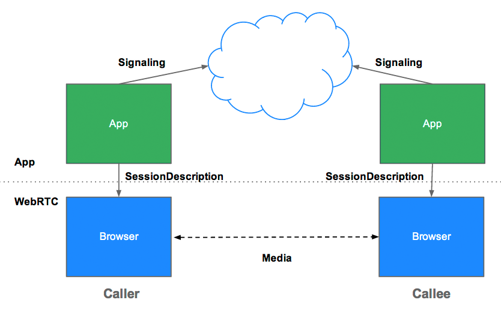
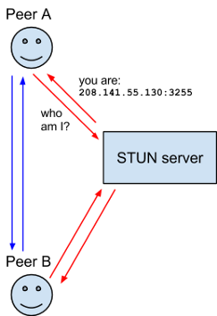
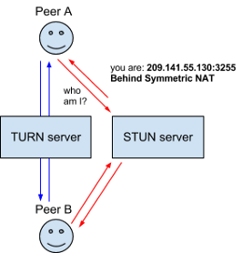

### WebRTC

#### 개념

Web Real-Time-Communication
- 웹 애플리케이션과 사이트가 중간자 없이 브라우저 간에 오디오나 영상 미디어를 포착하고 마음대로 스트림 할 뿐 아니라, 임의의 데이터도 교환할 수 있도록 하는 기술

    ->  드라이버나 플러그인 설치 없이 웹 브라우저 간 P2P 연결을 통해 데이터 교환을 가능하게 하는 기술

#### WebRTC Service

#### 특징

장점
- Latency가 짧다.
- 별다른 소프트웨어 없이 사용 가능하다.

단점
- 크로스 브라우징 문제
    - 지원하지 않는 브라우저, 버전이 있다.
    - 지금도 그러한가?
- STUN/TURN 서버가 필요하다.
    - P2P 통신을 하기 위해서는 사용자의 IP 주소를 알아야 한다.

#### API

- MediaStream
    - 카메라와 마이크 등의 데이터 스크림 접근
- RTCPeerConnection
    - 암호화 및 대역폭 관리 및 오디오, 비디오 연결
- RTCDataChannel
    - 일반적인 데이터의 P2P 통신

#### Signaling

- 시그널링을 통해 통신할 Peer간 정보를 교환한다.
- WebRTC를 사용해 연결을 맺고, peer의 단말에서 미디어를 가져와 교환한다.

*시그널링(Signaling)
    - WebRTC는 P2P연결을 통해 직접 통신하지만, 이를 중계해주는 과정이 필요하다. 이를 시그널링이라고 하며, 수행하는 서버를 시그널 서버라고 한다.

    - 시그널 서버는 연결하고자 하는 Peer들을 논리적으로 묶고 서로간에 SDP와 Candidate를 교환해준다.

    - 구현 방식에는 SIP, XMPP 등의 프로토콜을 사용해도 되고 Ajax long polling이나 websocket 등의 쌍방향 통신 채널 등이 있다.

    - 비동기적으로 발생하는 Peer들의 정보를 교환해야 하므로 전이중 통신을 지원하는 websocket으로 구현하는 것이 가장 적합하다.

    -> RTCPeerConnection 통신에 사용할 프로토콜, 채널, 미디어 코덱 및 형식, 데이터 전송 방법, 라우팅 정보와 NAT 통과 방법을 포함한 통신 규격을 교환하기 위해 두 장치의 제어 정보를 교환하는 과정

    - 역할
        - Session control message
            - 통신의 초기화, 종료, 그리고 에러 메세지
        - Network configuration
            - 외부에서 바라보는 IP와 포트 정보
                - Candidate에 서로를 추가
                - ICE 프레임워크를 사용하여 서로의 IP와 포트를 찾는 과정
        - Media capabilities
            - 상호 두 단말의 브라우저에서 사용 가능한 코덱, 해상도
            - offer와 answer 로직으로 진행
            - 형식은 SDP(Session Description Protocol)

- 서버가 필요한 이유
    - Signaling 사용자 탐색과 통신
    - 방화벽과 NAT 트래버셜
    - P2P 통신 중계서버

***

#### NAT Traversal

*P2P 절차
1. 각 브라우저가 P2P 통신에 동의
2. 서로의 주소를 공유
3. 보안 사항 및 방화벽 우회
4. 멀티미디어 데이터를 실시간으로 교환

하지만 브라우저는 웹 서버가 아니기 떄문에 외부에서 접근할 수 있는 주소가 없다.

    - 방화벽, NAT, DHCP

    - 그러므로 공인 IP뿐만 아니라 해당 네트워크에 연결된 사설 IP 주소까지 알아내야 사용자를 특정할 수 있다.

일반적으로 라우터가 NAT 역할을 한다. 외부에서 접근하는 공인 IP와 포트 번호를 확인하여 현재 네트워크 내의 사설 IP들을 적절히 매핑시켜준다.따라서 브라우저가 통신하려면, 각각 연결된 라우터의 공인 IP 주소와 포트를 먼저 알아내야 한다.

하지만 어떤 라우터들은 방화벽 설정이 되어 있을 수도 있다. 이런 경우에 라우터를 통과해서 연결할 방법을 찾는 과정을 NAT Traversal이라고 한다.

-> 라우터를 통과해서 연결할 방법을 찾는 과정(방화벽을 피해서)

* NAT(Network Address Translation)

    - IP 패킷의 TCP/UDP 포트 숫자와 소스 및 목적지의 IP 주소 등을 재기록하면서 라우터를 통해 네트워크 트래픽을 주고 받는 기술??

    - LAN은 Private IP이기 때문에 다른 네트워크에서는 통용되지 않는다. 그렇기 때문에 통상적인 네트워크에서 데이터를 주고 받기 위해서는 Public IP가 필요하다.

        -> Private IP를 Public IP로 1:1 대응시켜 변환하는 장치를 NAT라고 한다.

        -> WebRTC는 Perr의 정보(Public IP)를 알아야 하기 떄문에 NAT로 인해 문제가 발생한다.

*DHCP(Dynamic Host Configuration Protocol)
    - ??

#### STUN
NAT Traversal 작업은 STUN(Session Traversal Utilities for NAT) 서버에 의해 이루어진다.

STUN은 공개 주소를 발견하거나 Peer간의 직접 연결을 막는 등 라우터의 제한을 결정하며 ICE를 보완하는 프로토콜이다.

-> STUN 방식은 단말이 자신의 공인 IP 주소와 포트를 확인하는 과정에 대한 프로토콜이다.

-> STUN 서버는 해당 Peer의 Public IP 주소를 보내는 역할.

STUN은 두 엔드 포인트 간의 연결을 확인하고 NAT 바인딩을 유지하기 위한 연결 유지 프로토콜로도 사용할 수 있다.

클라이언트가 STUN 서버에 요청을 보내면 공인 IP 주소와 함께 통신에 필요한 정보들을 보내주는데 이를 이용해 다른 기기와 통신한다. 이러한 경우에도 통신이 되지 않는다면 TURN 서버로 넘기게 된다.

#### TURN

NAT 보안 정책이 너무 엄격하거나 NAT 순회를 하기 위해 필요한 바인딩을 성공적으로 생성할 수 없는 경우에 TURN을 사용한다.(, Symmetric NAT 제약조건을 우회하기 위해)

TURN 서버는 인터넷망에 위치하고 각 Peer들이 사설망(Private IP)안에서 통신한다. 

각 Peer들이 직접 통신하는 것이 아니라 릴레이 역할을 하는 TURN 서버를 사용하여 경유한다.

- TURN은 이러한 릴레이로부터 IP주소와 포트를 클라이언트가 취득할 수 있는 릴레이 주소를 할당한다.

TURN 서버와 연결을 맺고, 이 서버에서 모든 교환 과정을 중개한다. 모든 기기는 TURN 서버로 패킷을 보내고, 서버가 이를 포워딩한다. 모든 작업을 한 서버에서 처리하는 만큼 오버헤드가 있다.

#### ICE와 Candidate

- ICE(Interactive Connectivity Establishment)
    - 두 단말이 서로 통신할 수 있는 최적의 경로를 찾을 수 있도록 도와주는 프레임워크

방화벽이 존재하는 환경에서는 방화벽을 통과해야하고 단말의 퍼블릭 IP가 없다면 유일한 주소값을 할당해야하고 라우터가 Peer간의 직접연결을 허용하지 않을 때는 데이터를 릴레이해야한다.

ICE 프로세스를 사용하면 NAT가 통신을 위해 필요한 모든 포트를 열어두고 두 엔드 포인트 모두 다 연결할 수 있는 IP주소, 포트에 대한 완전한 정보를 갖게 된다.

ICE 혼자는 작동하지 않으며 STUN과 TURN 서버를 사용해야한다.

ICE Candidate Gathering
    - Local Address, Server Reflexive Address, Relayed Address 등 통신 가능한 주소들을 모두 가져온다. 이 주소들 중 가장 최적의 경로를 찾아서 연결시켜준다.

다른 설명

- STUN, TURN 서버를 이용해서 획득했던 IP 주소와 프로토콜, 포트의 조합으로 구성된 연결 가능한 네트워크 주소들을 후보(Candidate) 라고 하며 이 과정을 후보 찾기라고 한다.

- 후보들을 수집하면 일반적으로 3개의 주소를 얻게 된다.
    - 자신의 사설 IP와 포트 넘버
    - 자신의 공인 IP와 포트 넘버(STUN, TURN 서버로 부터 획득 가능)
    - TURN 서버의 IP와 포트 넘버(TURN 서버로 부터 획득 가능)

이 모든 과정은 ICE(Interactive Connectivity Establishment)라는 프레임워크 위에서 이루어진다.

ICE는 두 개의 단말이 P2P 연결을 가능하게 하도록 최적의 경로를 찾아주는 프레임워크다.

-> ICE는 STUN과 TURN을 활용하여 여러 Candidate를 검출하고 이들 중 하나를 선택하여 Peer 간 연결을 수행한다.

#### SDP

SDP(Session Description Protocol)는 스트리밍 미디어의 해상도나 형식, 코덱 등의 멀티미디어 컨텐츠의 초기 인수를 설명하기 위해 채택한 프로토콜이다.

미디어에 대한 메타 데이터로 사용할 수 있는 코덱, 사용하는 프로토콜, 비트레이트 값, 밴드위드스 값 같은 데이터가 텍스트 형태로 명시되어 있다.

PeerConnection 객체를 생성하게 되면 PeerConnectino 객체에서 offer SDP, answer SDP를 얻을 수 있다.
SDP는 발행 구독 모델(Pub/Sub)와 제안 응답 모델(Offer/Answer)을 가지고 있다.

#### Trickle ICE
일반적으로 각 피어는 ICE 후보들을 수집해서 그 목록을 완성한 후 한꺼번에 교환하는데 이러한 방식은 SDP의 제안 응답 모델과 맞물리면서 단점으로 작용한다.

후보를 모으는 데에도 시간이 오래 걸리고, 그 과정에서 네트워크 환경에 따라 지연이 걸릴 수 있다. 또한 한 쪽 피어의 ICE 후보 수집 작업이 완료되어야만 다른 피어가 ICE 후보를 모을 수 있기 때문에 비효율적이다.

-> 이러한 비효율적인 후보 교환 작업을 병렬 프로세스로 수행할 수 있게 만드는 것

-> 두 개의 피어가 ICE 후보를 수집하고 교환하는 과정을, 동기적 프로세스 에서 비동기적 프로세스 로 만드는 기술

Trickle 옵션이 활성화된 ICE 프레임워크는 각 피어에서 ICE 후보를 찾아내는 그 즉시 교환을 시작한다. 그래서 상호 간 연결 가능한 ICE를 보다 빨리 찾아낼 수 있다. 이러한 옵션 덕분에 ICE 프레임워크는 피어 간의 연결 상태를 체크함과 동시에 연결에 걸리는 시간을 최적화할 수 있다.

#### 나중에 더 찾아보기
- WebRTC는 기본적으로 실시간성이 매우 중요하기 때문에 UDP 위에서 동작한다. 즉 데이터를 빠르게 전송할 수는 있지만, 이 과정에서 발생한 데이터 손실이 발생할 수도 있다.

#### THE Path to WebRTC

#### 참고

https://gh402.tistory.com/45

https://velog.io/@heejinkim0812/WebRTC%EB%9E%80

https://gsretail.tistory.com/10
