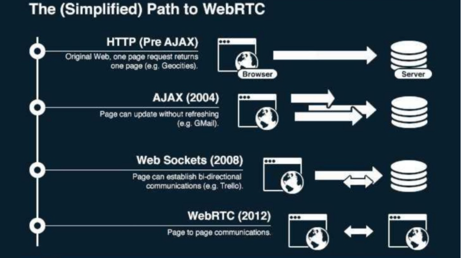

### WebRTC

#### 개념

Web Real-Time-Communication
- 웹 애플리케이션과 사이트가 중간자 없이 브라우저 간에 오디오나 영상 미디어를 포착하고 마음대로 스트림 할 뿐 아니라, 임의의 데이터도 교환할 수 있도록 하는 기술

->  드라이버나 플러그인 설치 없이 웹 브라우저 간 P2P 연결을 통해 데이터 교환을 가능하게 하는 기술

#### 특징

장점
- Latency가 짧다.
- 별다른 소프트웨어 없이 사용 가능하다.

단점
- 크로스 브라우징 문제
    - 지원하지 않는 브라우저, 버전이 있다.(IE)
- STUN/TURN 서버가 필요하다.
    - P2P 통신을 하기 위해서는 사용자의 IP 주소를 알아야 한다.

#### API

- MediaStream
    - 카메라와 마이크 등의 데이터 스크림 접근
- RTCPeerConnection
    - 암호화 및 대역폭 관리 및 오디오, 비디오 연결
- RTCDataChannel
    - 일반적인 데이터의 P2P 통신

#### 동작 원리

시그널링(Signaling)
    - RTCPeerConnection 들이 적절하게 데이터를 교환할 수 있게 처리해 주는 과정
    - NAT 우회 과정

*P2P 절차
1. 각 브라우저가 P2P 통신에 동의
2. 서로의 주소를 공유
3. 보안 사항 및 방화벽 우회
4. 멀티미디어 데이터를 실시간으로 교환

브라우저는 웹 서버가 아니기 떄문에 외부에서 접근할 수 있는 주소가 없다.

NAT Traversal
- 라우터를 통과해서 연결할 방법을 찾는 과정(방화벽을 피해서)

STUN, TURN
- NAT Traversal 작업은 STUN(Session Traversal Utilities for NAT) 서버에 의해 이루어진다.
- STUN 방식은 단말이 자신의 공인 IP 주소와 포트를 확인하는 과정에 대한 프로토콜이다.
- STUN 서버는 인터넷의 복잡한 주소들 속에서 유일하게 자기 자신을 식별할 수 있는 정보를 반환해준다.
- WebRTC 연결을 시작하기 전에 STUN 서버를 향해 요청을 보내면, STUN 서버는 NAT 뒤에 있는 피어(Peer)들이 서로 연결할 수 있도록 공인 IP와 포트를 찾아준다.

- TURN 방식은 네트워크 미디어를 중개하는 서버를 이용하는 것이다.
-  TURN 방식은 중간에 서버를 한 번 거치기 때문에, 엄밀히 이야기하자면 P2P 통신이 아니게 되며 그 구조상 지연이 필연적으로 발생하게 된다.
- STUN 서버를 통해 자기 자신의 주소를 찾아내지 못했을 경우, TURN(Traversal Using Relay NAT) 서버를 대안으로 이용하게 된다.

*NAT(Network Address Translation)
    - IP 패킷의 TCP/UDP 포트 숫자와 소스 및 목적지의 IP 주소 등을 재기록하면서 라우터를 통해 네트워크 트래픽을 주고 받는 기술

*DHCP(Dynamic Host Configuration Protocol)
    - ??

#### ICE와 Candidate

- STUN, TURN 서버를 이용해서 획득했던 IP 주소와 프로토콜, 포트의 조합으로 구성된 연결 가능한 네트워크 주소들을 후보(Candidate) 라고 하며 이 과정을 후보 찾기라고 한다.

- 후보들을 수집하면 일반적으로 3개의 주소를 얻게 된다.
    - 자신의 사설 IP와 포트 넘버
    - 자신의 공인 IP와 포트 넘버(STUN, TURN 서버로 부터 획득 가능)
    - TURN 서버의 IP와 포트 넘버(TURN 서버로 부터 획득 가능)

이 모든 과정은 ICE(Interactive Connectivity Establishment)라는 프레임워크 위에서 이루어진다.
ICE는 두 개의 단말이 P2P 연결을 가능하게 하도록 최적의 경로를 찾아주는 프레임워크다.

#### SDP

- Session Description Protocol는 스트리밍 미디어의 해상도나 형식, 코덱 등의 멀티미디어 컨텐츠의 초기 인수를 설명하기 위해 채택한 프로토콜이다.
- SDP는 발행 구독 모델(Pub/Sub)와 제안 응답 모델(Offer/Answer)을 가지고 있다.
- 어떤 피어가 이러한 미디어 스트림을 교환할 것이라고 제안을 하면, 상대방으로부터 응답이 오기를 기다린다.

##### THE Path to WebRTC
