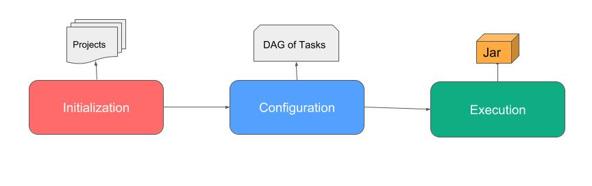

### Maven? Gradle?

- 빌드 관리 도구
    - 라이브러리를 자동으로 관리해주는 도구

#### Maven

##### 개념
- 자바 전용 프로젝트 LifeCycle 관리 목적 빌드 도구
- Apache Ant의 불편함을 해결하고자 만들어짐
    - 무슨 불편함?

##### 특징
- 빌드 절차를 간소화하여 쉽게 만들 수 있다.
- 정형화된 빌드 시스템을 제공한다.
- Pom.xml 파일을 통해 프로젝트를 빌드한다.

- 설정파일 : pim.xml, setting.xml

##### Life Cycle

- Default(Build) : 일반적인 빌드 프로세스를 위한 모델이다.
- clean : 빌드 시 생성되었던 Output 및 파일들을 지워주는 단계
- Vaildate : 프로젝트가 올바른지 확인하고 필요한 모든 정보를 사용할 수 있는지 확인하는 단계
- Compile : 프로젝트의 소스 코드를 컴파일 하는 단계
- Test : 유닛(단위) 테스트를 수행하는 단계(테스트 실패 시 빌드 실패로 처리, 스킵 가능)
- Package : 실제 컴파일 된 소스 코드와 리소스들을 jar 파일 등의 배포를 위한 패키지로 만드는 단계
- Install : 패키지를 로컬 저장소에 설치하는 단계
- Default(Build) : 일반적인 빌드 프로세스를 위한 모델이다.
- Site : 프로젝트 문서와 사이트 작성, 생성하는 단계
- Deploy : 만들어진 package를 원격 저장소에 release 하는 단계

#### Gradle

##### 개념
- Maven을 대체할 수 있는 프로젝트 구성 관리 및 범용 빌드 툴이며 Ant Builder와 Groovy Script를 기반으로 구축되어 기존 Ant의 역할과 배포 스크립의 기능을 모두 사용 가능하며 스프링부트와 안드로이드에서 사용된다.

- Ant + Maven

##### 특징
- 설정 주입 방식(Configuration Injection)을 사용한다.
    - Maven의 상속 구조에 비해 재사용이 용이하다.
- xml에 비해 간결하게 사용 가능하다.
- Groovy 기반의 DSL(Domain Specific Language)을 사용하여 코드로서 설정정보를 구성한다.
- 멀티 프로젝트 빌드를 지원한다.(이를 위해 만들어졌다?)
- Maven과 lvy를 완전 지원한다.

* Groovy : JVM에서 사용되는 스크립트 언어

- 설정파일 : setting.gadle, build.gradle

##### LifeCycle

- 초기화(initialization) : 빌드 대상 프로젝트를 결정하고 각각에 대한 Project 객체를 생성한다. settings.gradle 파일에서 프로젝트를 구성한다.
- 구성(Configuration) : 빌드 대상이 되는 모든 프로젝트의 빌드 스크립트를 실행한다.
- 실행(Execution) : 구성 단계에서 생성하고 설정된 프로젝트의 테스크 중에 실행 대상을 결정한다. gradle 명령행에서 지정한 태스크 이름 인자와 현재 디렉토리를 기반으로 태스크를 결정하여 선택된 태스크들을 실행한다.

