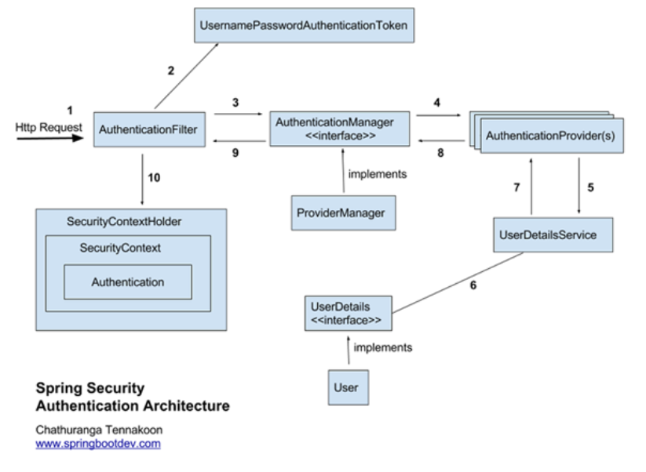

### Spring Security

#### 개념
- 스프링 기반의 인증, 권한 등 보안 기능을 제공하는 프레임워크
- 인증(Authentication) : 본인이 맞는가?
- 인가(Authorization) : 자원에 접급 가능한가?

#### Filter
- Filter 기반 동작 : Spring MVC와 분리되어 관리 및 동작.
- Bean으로 설정할 수 있다.
- Spring Web MVC에서 Client의 요청을 가장 먼저 받는 것은 DispatcherServlet이다.
- DS가 요청을 받기 전에 다양한 필터가 있을 수 있다.

#### Spring Security Architecture

1. Client로부터 HttpRequest 수신
    - 로그인 정보와 함께 인증 요청
2. 인증 토큰 생성
    - AuthenticationFilter(인증 필터)가 요청을 intercepter하고, 
    가로챈 정보를 통해 UsernamePasswordAuthenticationToken의 인증용 객체를 생성
3. Filter를 통해 AuthenticationToken을 AuthenticationManager로 위임
    - 

#### 사용
- Gradle : 'org.springframework.boot:spring-boot-starter-security' 추가

- application.properties에 기본 name/password를 설정할 수 있다.
    spring.security.user.name=ssafy
    spring.security.user.password=1234

- SecurityConfig Class( WebSecurityConfigurerAdapter 상속 )

